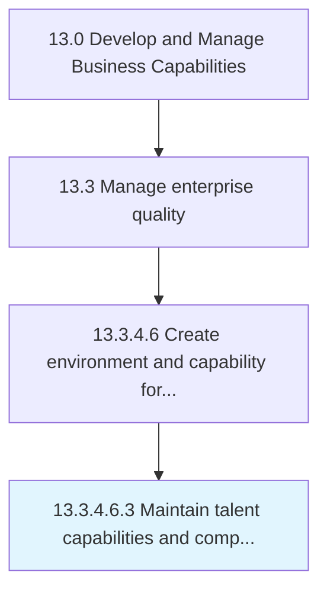

# Maintain talent capabilities and competencies

> Maintaining a common denominator for the competency level within the organization's talent circle.

## Overview

Sub-Activity 13.3.4.6.3 is an activity within the Develop and Manage Business Capabilities framework. 

Maintaining a common denominator for the competency level within the organization's talent circle. Conduct training sessions, skill development activities, and quality excellence activities to ensure that the resources of the organization are competent enough and have the capabilities to achieve the required level of quality.

## Process Hierarchy



## Key Statistics

| Metric | Value |
|--------|-------|
| APQC Code | 17507 |
| Hierarchy ID | 13.3.4.6.3 |
| Level | Sub-Activity |
| Parent | [13.3.4.6](../) |
| Sub-Processes | 0 |


## GraphDL Semantic Structure

```
maintain.TalentCapabilitiesAndCompetencies
```

| Component | Value | Description |
|-----------|-------|-------------|
| Verb | `maintain` | Primary action |
| Object | `talent capabilities and competencies` | Direct object |


## Related Concepts

- [TalentCapabilities](/concepts/TalentCapabilities)
- [Competencies](/concepts/Competencies)


---

*Source: APQC PCF 17507 (13.3.4.6.3) - APQC*
