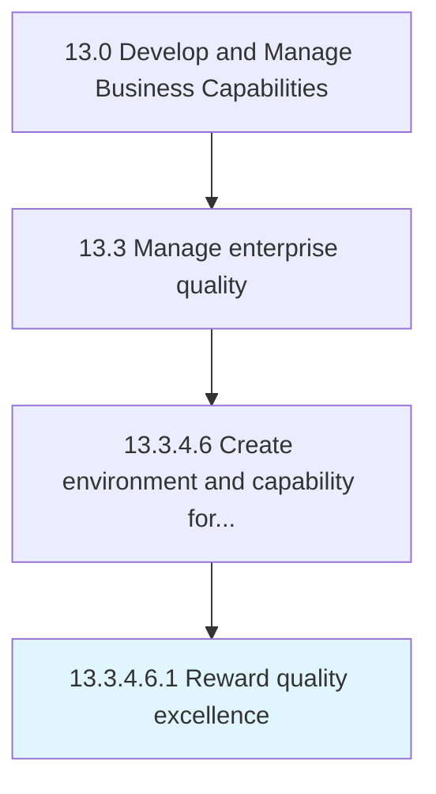

# Reward quality excellence

> Provisioning rewards for achieving quality excellence.

## Overview

Sub-Activity 13.3.4.6.1 is an activity within the Develop and Manage Business Capabilities framework. 

Provisioning rewards for achieving quality excellence. Provide monetary and nonmonetary rewards such as compensation, vacations, gift cards, and reimbursements to employees in in recognition of their services, efforts, and achievements in quality excellence.

## Process Hierarchy



## Key Statistics

| Metric | Value |
|--------|-------|
| APQC Code | 17505 |
| Hierarchy ID | 13.3.4.6.1 |
| Level | Sub-Activity |
| Parent | [13.3.4.6](../) |
| Sub-Processes | 0 |


## GraphDL Semantic Structure

```
reward.QualityExcellence
```

| Component | Value | Description |
|-----------|-------|-------------|
| Verb | `reward` | Primary action |
| Object | `quality excellence` | Direct object |


## Related Concepts

- [QualityExcellence](/concepts/QualityExcellence)


---

*Source: APQC PCF 17505 (13.3.4.6.1) - APQC*
