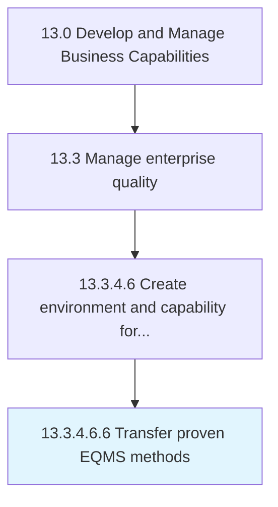

# Transfer proven EQMS methods

> Recording and transferring the best practices and proven methods associated with enterprise quality management systems (EQMS) that can be leveraged in improving the organization's framework.

## Overview

Sub-Activity 13.3.4.6.6 is an activity within the Develop and Manage Business Capabilities framework. 

Recording and transferring the best practices and proven methods associated with enterprise quality management systems (EQMS) that can be leveraged in improving the organization's framework. Record proven methodologies and approaches with the objective of communicating them for upgrading, refining, and enhancing the organization's systems.

## Process Hierarchy



## Key Statistics

| Metric | Value |
|--------|-------|
| APQC Code | 17510 |
| Hierarchy ID | 13.3.4.6.6 |
| Level | Sub-Activity |
| Parent | [13.3.4.6](../) |
| Sub-Processes | 0 |


## GraphDL Semantic Structure

```
transfer.ProvenEQMSMethods
```

| Component | Value | Description |
|-----------|-------|-------------|
| Verb | `transfer` | Primary action |
| Object | `proven EQMS methods` | Direct object |


## Related Concepts

- [ProvenEQMSMethods](/concepts/ProvenEQMSMethods)


---

*Source: APQC PCF 17510 (13.3.4.6.6) - APQC*
