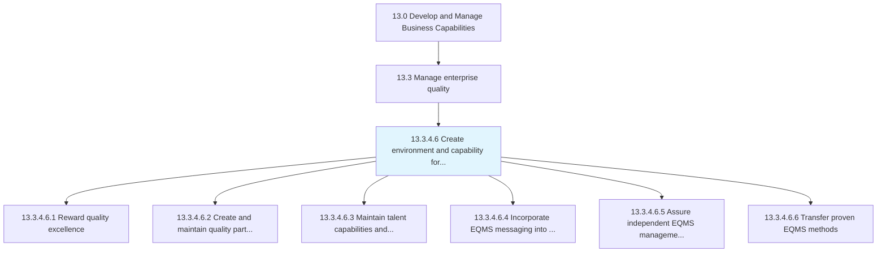
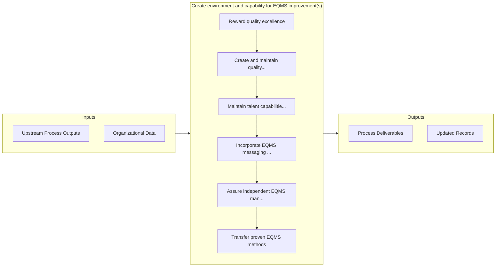

# Create environment and capability for EQMS improvement(s)

> Rewarding excellence in quality.

## Overview

Activity 13.3.4.6 is an activity within the Develop and Manage Business Capabilities framework. 

Rewarding excellence in quality. Create and maintain quality partnerships. Maintain talent capabilities and competencies. Incorporate EQMS messaging into communication channels. Transfer proven EQMS methods. Consider factors such as EQMS reviews and gap assessments and the alignment and compatibility of business processes and quality. Adopt Lean principles.

## Process Hierarchy



## Key Statistics

| Metric | Value |
|--------|-------|
| APQC Code | 17504 |
| Hierarchy ID | 13.3.4.6 |
| Level | Activity |
| Parent | [13.3.4](../) |
| Sub-Processes | 6 |


## GraphDL Semantic Structure

```graphdl
create.EnvironmentAndCapability.for.EQMSImprovements
```

| Component | Value | Description |
|-----------|-------|-------------|
| Verb | `create` | Primary action |
| Object | `environment and capability` | Direct object |
| Preposition | `for` | Relationship |
| PrepObject | `EQMS improvement(s)` | Indirect object |


## Process Flow



## Sub-Processes

| Process | Hierarchy ID | Description |
|---------|-------------|-------------|
| [Reward quality excellence](./RewardQualityExcellence) | 13.3.4.6.1 | Provisioning rewards for achieving quality excellence |
| [Create and maintain quality partnerships](./CreateAndMaintainQualityPartnerships) | 13.3.4.6.2 | Establishing and maintaining partnerships with third-party sources to achieve quality excellence |
| [Maintain talent capabilities and competencies](./MaintainTalentCapabilitiesAndCompetencies) | 13.3.4.6.3 | Maintaining a common denominator for the competency level within the organization's talent circle |
| [Incorporate EQMS messaging into communication channels](./IncorporateEQMSMessagingIntoCommunicationChannels) | 13.3.4.6.4 | Assimilating all the communication related to the EQMS into the organization's already established c |
| [Assure independent EQMS management access to appropriate authority in the organization](./AssureIndependentEQMSManagementAccessToAppropriateAuthorityInTheOrganization) | 13.3.4.6.5 | Ensuring EQMS access to the person in charge of the quality management process |
| [Transfer proven EQMS methods](./TransferProvenEQMSMethods) | 13.3.4.6.6 | Recording and transferring the best practices and proven methods associated with enterprise quality  |


## Related Concepts

- Environment
- EQMSImprovement(S
- Capability
- EQMSImprovement(S


---

*Source: APQC PCF 17504 (13.3.4.6) - APQC*
