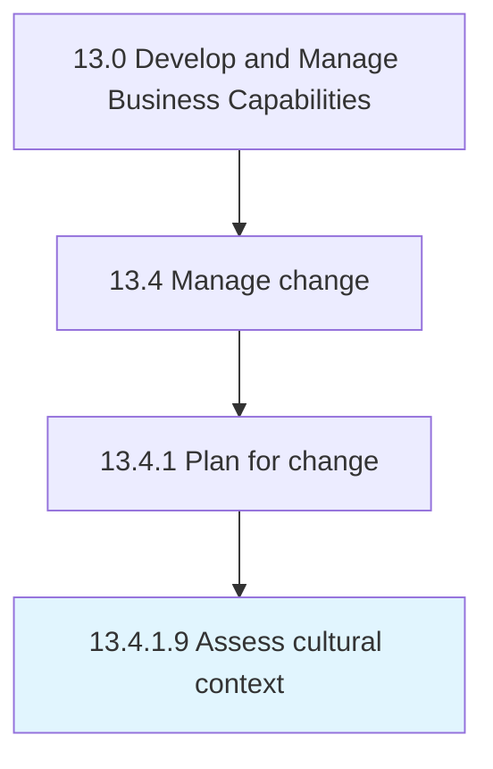

# Assess cultural context

> Evaluating the culture within the organization.

## Overview

Activity 13.4.1.9 is an activity within the Develop and Manage Business Capabilities framework. 

Evaluating the culture within the organization. Adopt a quantitative, multidimensional measurement approach of an organization's culture and the aspirations for it. Diagnose cultural activities, enhance leadership sections. Integrate cultures.

## Process Hierarchy



## Key Statistics

| Metric | Value |
|--------|-------|
| APQC Code | 11147 |
| Hierarchy ID | 13.4.1.9 |
| Level | Activity |
| Parent | [13.4.1](../) |
| Sub-Processes | 0 |


## GraphDL Semantic Structure

```
assess.CulturalContext
```

| Component | Value | Description |
|-----------|-------|-------------|
| Verb | `assess` | Primary action |
| Object | `cultural context` | Direct object |


## Related Concepts

- [CulturalContext](/concepts/CulturalContext)


---

*Source: APQC PCF 11147 (13.4.1.9) - APQC*
