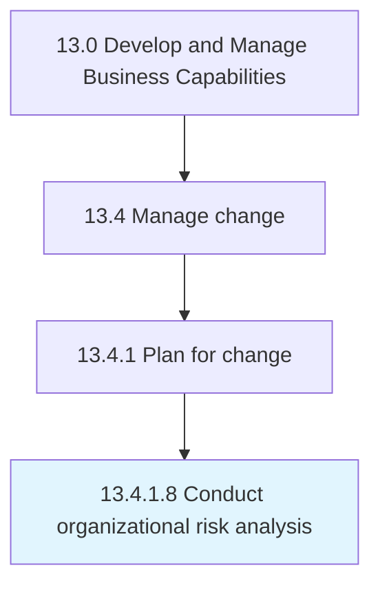

# Conduct organizational risk analysis

> Looking beyond the immediate consequences of the threat to a critical asset and placing it in the context of what is important to the organization.

## Overview

Activity 13.4.1.8 is an activity within the Develop and Manage Business Capabilities framework. 

Looking beyond the immediate consequences of the threat to a critical asset and placing it in the context of what is important to the organization. Identify the impact of threats to critical assets. Create risk evaluation criteria. Evaluate the impact of threats to critical assets. Incorporate probability into the risk analysis.

## Process Hierarchy



## Key Statistics

| Metric | Value |
|--------|-------|
| APQC Code | 11146 |
| Hierarchy ID | 13.4.1.8 |
| Level | Activity |
| Parent | [13.4.1](../) |
| Sub-Processes | 0 |


## GraphDL Semantic Structure

```
conduct.OrganizationalRiskAnalysis
```

| Component | Value | Description |
|-----------|-------|-------------|
| Verb | `conduct` | Primary action |
| Object | `organizational risk analysis` | Direct object |


## Related Concepts

- OrganizationalRiskAnalysis


---

*Source: APQC PCF 11146 (13.4.1.8) - APQC*
