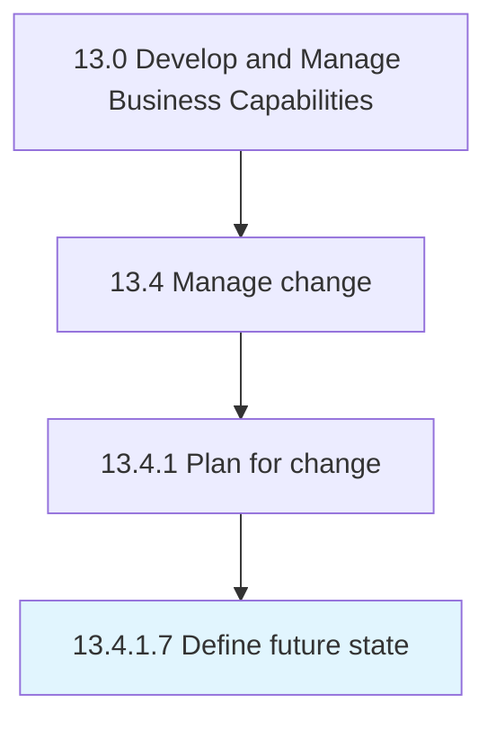

# Define future state

> Determining the state or position that the organization wants to be in after the implementation of the change.

## Overview

Activity 13.4.1.7 is an activity within the Develop and Manage Business Capabilities framework. 

Determining the state or position that the organization wants to be in after the implementation of the change. Gather necessary information about the processes, structures, and cultures. Define resource requirements.

## Process Hierarchy



## Key Statistics

| Metric | Value |
|--------|-------|
| APQC Code | 11145 |
| Hierarchy ID | 13.4.1.7 |
| Level | Activity |
| Parent | [13.4.1](../) |
| Sub-Processes | 0 |


## GraphDL Semantic Structure

```
define.FutureState
```

| Component | Value | Description |
|-----------|-------|-------------|
| Verb | `define` | Primary action |
| Object | `future state` | Direct object |


## Related Concepts

- [FutureState](/concepts/FutureState)


---

*Source: APQC PCF 11145 (13.4.1.7) - APQC*
