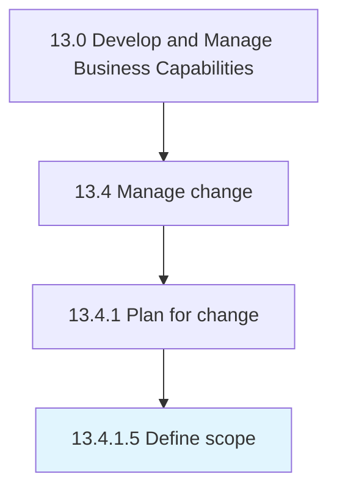

# Define scope

> Defining the extent of the area or subject matter that the change process deals with or to which it is relevant.

## Overview

Activity 13.4.1.5 is an activity within the Develop and Manage Business Capabilities framework. 

Defining the extent of the area or subject matter that the change process deals with or to which it is relevant. Establish a set of tools, processes, skills, and principles for managing the people side of change to achieve the required outcomes of the change process.

## Process Hierarchy



## Key Statistics

| Metric | Value |
|--------|-------|
| APQC Code | 11143 |
| Hierarchy ID | 13.4.1.5 |
| Level | Activity |
| Parent | [13.4.1](../) |
| Sub-Processes | 0 |


## GraphDL Semantic Structure

```
define.Scope
```

| Component | Value | Description |
|-----------|-------|-------------|
| Verb | `define` | Primary action |
| Object | `scope` | Direct object |


## Related Concepts

- Scope


---

*Source: APQC PCF 11143 (13.4.1.5) - APQC*
