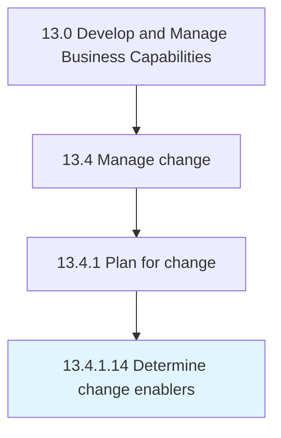

# Determine change enablers

> Identifying the person(s) or thing(s)responsible for making the change possible.

## Overview

Activity 13.4.1.14 is an activity within the Develop and Manage Business Capabilities framework. 

Identifying the person(s) or thing(s)responsible for making the change possible. Consider factors such as interdependence of efforts, reward to the integrators, sharing of power and responsibility, and employee understanding of why change is essential.

## Process Hierarchy



## Key Statistics

| Metric | Value |
|--------|-------|
| APQC Code | 11150 |
| Hierarchy ID | 13.4.1.14 |
| Level | Activity |
| Parent | [13.4.1](../) |
| Sub-Processes | 0 |


## GraphDL Semantic Structure

```
determine.ChangeEnablers
```

| Component | Value | Description |
|-----------|-------|-------------|
| Verb | `determine` | Primary action |
| Object | `change enablers` | Direct object |


## Related Concepts

- ChangeEnablers


---

*Source: APQC PCF 11150 (13.4.1.14) - APQC*
