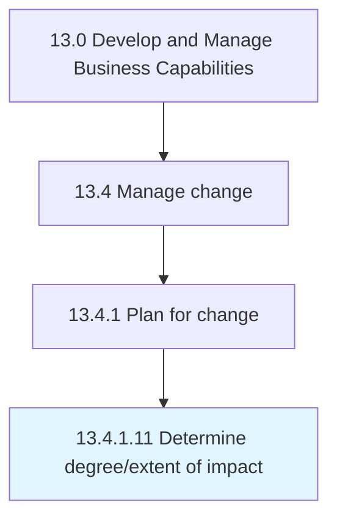

# Determine degree/extent of impact

> Evaluating the impact of threats to critical assets.

## Overview

Activity 13.4.1.11 is an activity within the Develop and Manage Business Capabilities framework. 

Evaluating the impact of threats to critical assets. Determine what assets will be impacted by the change.

## Process Hierarchy



## Key Statistics

| Metric | Value |
|--------|-------|
| APQC Code | 20144 |
| Hierarchy ID | 13.4.1.11 |
| Level | Activity |
| Parent | [13.4.1](../) |
| Sub-Processes | 0 |


## GraphDL Semantic Structure

```
determine.Degreeextent.of.Impact
```

| Component | Value | Description |
|-----------|-------|-------------|
| Verb | `determine` | Primary action |
| Object | `degree/extent` | Direct object |
| Preposition | `of` | Relationship |
| PrepObject | `impact` | Indirect object |


## Related Concepts

- [Degree](/concepts/Degree)
- [Impact](/concepts/Impact)
- [Extent](/concepts/Extent)
- [Impact](/concepts/Impact)


---

*Source: APQC PCF 20144 (13.4.1.11) - APQC*
