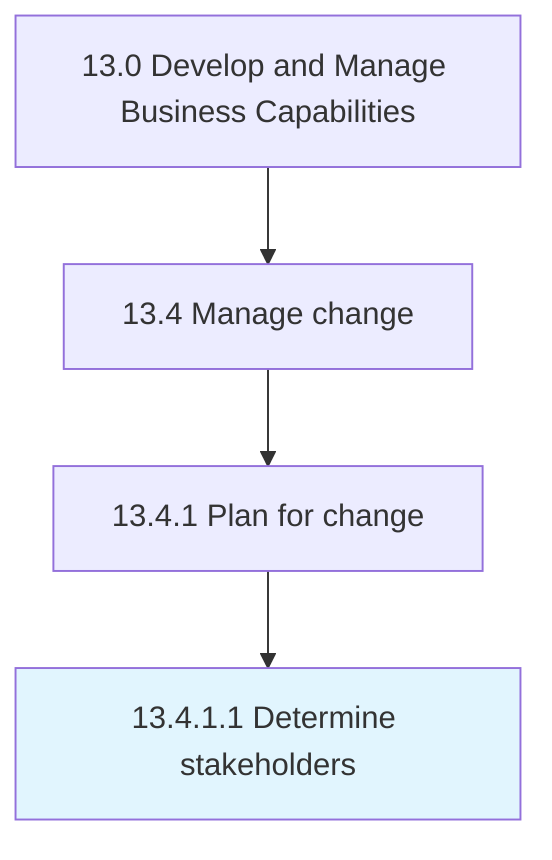

# Determine stakeholders

> Identifying and communicating with shareholders affected by the change.

## Overview

Activity 13.4.1.1 is an activity within the Develop and Manage Business Capabilities framework. 

Identifying and communicating with shareholders affected by the change. Consider internal and external stakeholders that will be affected by the change. Determine the amount of influence the change will have on them. Ensure the involvement of these stakeholders in the change process by effectively communicating with them.

## Process Hierarchy



## Key Statistics

| Metric | Value |
|--------|-------|
| APQC Code | 11140 |
| Hierarchy ID | 13.4.1.1 |
| Level | Activity |
| Parent | [13.4.1](../) |
| Sub-Processes | 0 |


## GraphDL Semantic Structure

```
determine.Stakeholders
```

| Component | Value | Description |
|-----------|-------|-------------|
| Verb | `determine` | Primary action |
| Object | `stakeholders` | Direct object |


## Related Concepts

- Stakeholders


---

*Source: APQC PCF 11140 (13.4.1.1) - APQC*
