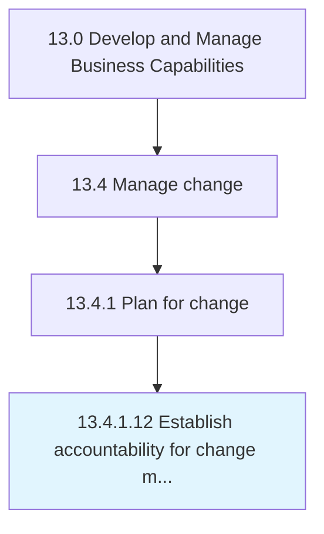

# Establish accountability for change management

> Identifying and assigning the people accountable for effective change management.

## Overview

Activity 13.4.1.12 is an activity within the Develop and Manage Business Capabilities framework. 

Identifying and assigning the people accountable for effective change management. Hold managers accountable for ensuring change happens systematically and rigorously. Ensure that certain behaviors are rewarded or reprimanded accordingly.

## Process Hierarchy



## Key Statistics

| Metric | Value |
|--------|-------|
| APQC Code | 11148 |
| Hierarchy ID | 13.4.1.12 |
| Level | Activity |
| Parent | [13.4.1](../) |
| Sub-Processes | 0 |


## GraphDL Semantic Structure

```
establish.Accountability.for.ChangeManagement
```

| Component | Value | Description |
|-----------|-------|-------------|
| Verb | `establish` | Primary action |
| Object | `accountability` | Direct object |
| Preposition | `for` | Relationship |
| PrepObject | `change management` | Indirect object |


## Related Concepts

- Accountability
- ChangeManagement


---

*Source: APQC PCF 11148 (13.4.1.12) - APQC*
