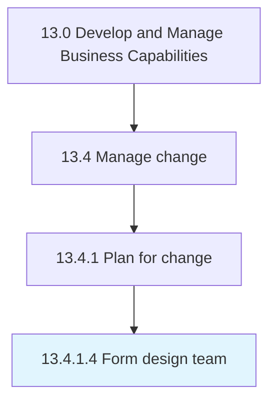

# Form design team

> Preparing a design team for implementing change throughout the organization.

## Overview

Activity 13.4.1.4 is an activity within the Develop and Manage Business Capabilities framework. 

Preparing a design team for implementing change throughout the organization.

## Process Hierarchy



## Key Statistics

| Metric | Value |
|--------|-------|
| APQC Code | 11142 |
| Hierarchy ID | 13.4.1.4 |
| Level | Activity |
| Parent | [13.4.1](../) |
| Sub-Processes | 0 |


## GraphDL Semantic Structure

```
form.DesignTeam
```

| Component | Value | Description |
|-----------|-------|-------------|
| Verb | `form` | Primary action |
| Object | `design team` | Direct object |


## Related Concepts

- DesignTeam


---

*Source: APQC PCF 11142 (13.4.1.4) - APQC*
