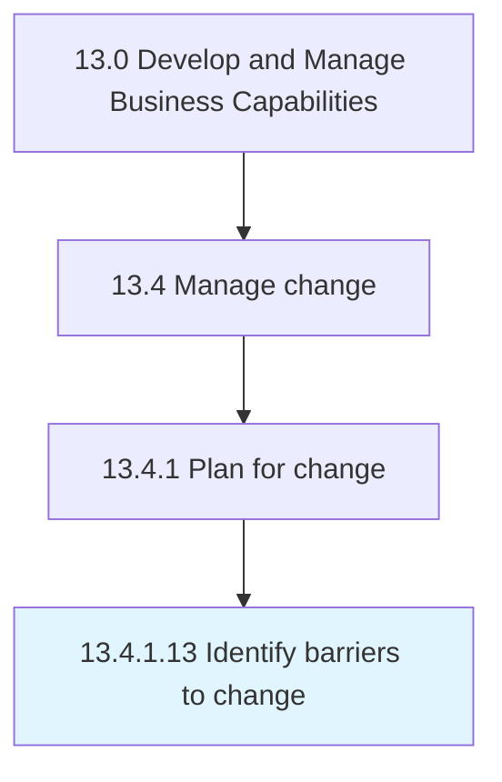

# Identify barriers to change

> Recognizing the circumstances or obstacles that keep the organization from progressing.

## Overview

Activity 13.4.1.13 is an activity within the Develop and Manage Business Capabilities framework. 

Recognizing the circumstances or obstacles that keep the organization from progressing. Identify who and what are the resources resisting change. Identify integration failures, threats by competitive forces, and complexity failures.

## Process Hierarchy



## Key Statistics

| Metric | Value |
|--------|-------|
| APQC Code | 11149 |
| Hierarchy ID | 13.4.1.13 |
| Level | Activity |
| Parent | [13.4.1](../) |
| Sub-Processes | 0 |


## GraphDL Semantic Structure

```
identify.Barriers.to.Change
```

| Component | Value | Description |
|-----------|-------|-------------|
| Verb | `identify` | Primary action |
| Object | `barriers` | Direct object |
| Preposition | `to` | Relationship |
| PrepObject | `change` | Indirect object |


## Related Concepts

- [Barriers](/concepts/Barriers)
- [Change](/concepts/Change)


---

*Source: APQC PCF 11149 (13.4.1.13) - APQC*
