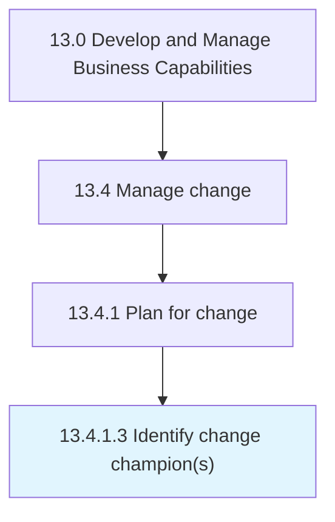

# Identify change champion(s)

> Identifying people exhibit an extraordinary interest in the adoption, implementation, and success of the change.

## Overview

Activity 13.4.1.3 is an activity within the Develop and Manage Business Capabilities framework. 

Identifying people exhibit an extraordinary interest in the adoption, implementation, and success of the change. Engage champions in each division or team. Define the roles and responsibilities for the change champions. Determine criteria for selecting change champions. Provide training sessions to champions. Reward and recognize champions.

## Process Hierarchy



## Key Statistics

| Metric | Value |
|--------|-------|
| APQC Code | 11141 |
| Hierarchy ID | 13.4.1.3 |
| Level | Activity |
| Parent | [13.4.1](../) |
| Sub-Processes | 0 |


## GraphDL Semantic Structure

```
identify.ChangeChampions
```

| Component | Value | Description |
|-----------|-------|-------------|
| Verb | `identify` | Primary action |
| Object | `change champion(s)` | Direct object |


## Related Concepts

- ChangeChampion(S


---

*Source: APQC PCF 11141 (13.4.1.3) - APQC*
