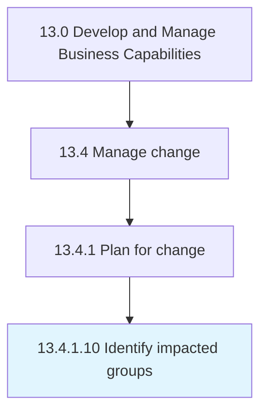

# Identify impacted groups

> Recognizing the impact of threats to critical assets.

## Overview

Activity 13.4.1.10 is an activity within the Develop and Manage Business Capabilities framework. 

Recognizing the impact of threats to critical assets. Determine what groups are impacted by this impact.

## Process Hierarchy



## Key Statistics

| Metric | Value |
|--------|-------|
| APQC Code | 20143 |
| Hierarchy ID | 13.4.1.10 |
| Level | Activity |
| Parent | [13.4.1](../) |
| Sub-Processes | 0 |


## GraphDL Semantic Structure

```
identify.ImpactedGroups
```

| Component | Value | Description |
|-----------|-------|-------------|
| Verb | `identify` | Primary action |
| Object | `impacted groups` | Direct object |


## Related Concepts

- ImpactedGroups


---

*Source: APQC PCF 20143 (13.4.1.10) - APQC*
