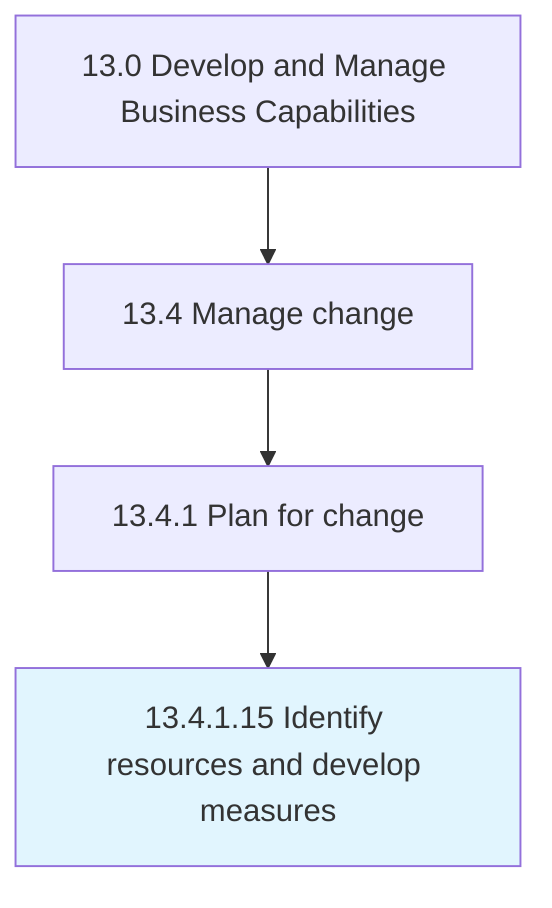

# Identify resources and develop measures

> Recognizing the resource requirements, and developing measures for change.

## Overview

Activity 13.4.1.15 is an activity within the Develop and Manage Business Capabilities framework. 

Recognizing the resource requirements, and developing measures for change. Identify the financial, material, human, and informational resources needed to successfully implement the change. Develop programs, campaigns, etc. for establishing the change within the organization.

## Process Hierarchy



## Key Statistics

| Metric | Value |
|--------|-------|
| APQC Code | 11151 |
| Hierarchy ID | 13.4.1.15 |
| Level | Activity |
| Parent | [13.4.1](../) |
| Sub-Processes | 0 |


## GraphDL Semantic Structure

```
identify.ResourcesAndDevelopMeasures
```

| Component | Value | Description |
|-----------|-------|-------------|
| Verb | `identify` | Primary action |
| Object | `resources and develop measures` | Direct object |


## Related Concepts

- [ResourcesMeasures](/concepts/ResourcesMeasures)
- [DevelopMeasures](/concepts/DevelopMeasures)


---

*Source: APQC PCF 11151 (13.4.1.15) - APQC*
