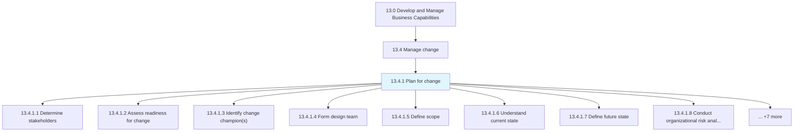
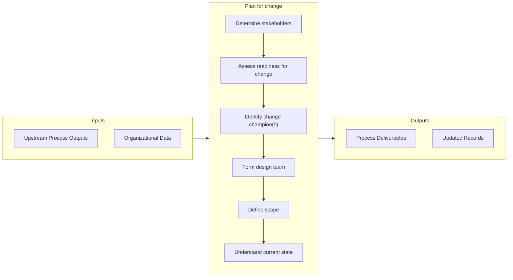

# Plan for change

> Evaluating impact and planning change activities.

## Overview

Process 13.4.1 is a core process that defines the specific procedures for plan for change. 

Evaluating impact and planning change activities. Spanning the lifecycle of change from initial concept, to designing, implementing, and sustaining the change, change planning identifies the activities to enage and enable the stakeholders and all impacted by the change. Change plans should address the interplay between people, process, technology, and knowledge to guide the transition, or tranformation, from current state to the future state.

## Process Hierarchy



## Key Statistics

| Metric | Value |
|--------|-------|
| APQC Code | 21457 |
| Hierarchy ID | 13.4.1 |
| Level | Process |
| Parent | [13.4](../) |
| Sub-Processes | 15 |


## GraphDL Semantic Structure

```graphdl
plan.ForChange
```

| Component | Value | Description |
|-----------|-------|-------------|
| Verb | `plan` | Primary action |
| Object | `for change` | Direct object |


## Process Flow



## Sub-Processes

| Process | Hierarchy ID | Description |
|---------|-------------|-------------|
| [Determine stakeholders](./DetermineStakeholders) | 13.4.1.1 | Identifying and communicating with shareholders affected by the change |
| [Assess readiness for change](./AssessReadinessForChange) | 13.4.1.2 | Determining the level of preparedness of the conditions, attitudes, and resources at all levels in t |
| [Identify change champion(s)](./IdentifyChangeChampions) | 13.4.1.3 | Identifying people exhibit an extraordinary interest in the adoption, implementation, and success of |
| [Form design team](./FormDesignTeam) | 13.4.1.4 | Preparing a design team for implementing change throughout the organization |
| [Define scope](./DefineScope) | 13.4.1.5 | Defining the extent of the area or subject matter that the change process deals with or to which it  |
| [Understand current state](./UnderstandCurrentState) | 13.4.1.6 | Using graphical and statistical tools such as pareto diagrams, process flow diagrams, cause-and-effe |
| [Define future state](./DefineFutureState) | 13.4.1.7 | Determining the state or position that the organization wants to be in after the implementation of t |
| [Conduct organizational risk analysis](./ConductOrganizationalRiskAnalysis) | 13.4.1.8 | Looking beyond the immediate consequences of the threat to a critical asset and placing it in the co |
| [Assess cultural context](./AssessCulturalContext) | 13.4.1.9 | Evaluating the culture within the organization |
| [Identify impacted groups](./IdentifyImpactedGroups) | 13.4.1.10 | Recognizing the impact of threats to critical assets |
| [Determine degree/extent of impact](./DetermineDegreeextentOfImpact) | 13.4.1.11 | Evaluating the impact of threats to critical assets |
| [Establish accountability for change management](./EstablishAccountabilityForChangeManagement) | 13.4.1.12 | Identifying and assigning the people accountable for effective change management |
| [Identify barriers to change](./IdentifyBarriersToChange) | 13.4.1.13 | Recognizing the circumstances or obstacles that keep the organization from progressing |
| [Determine change enablers](./DetermineChangeEnablers) | 13.4.1.14 | Identifying the person(s) or thing(s)responsible for making the change possible |
| [Identify resources and develop measures](./IdentifyResourcesAndDevelopMeasures) | 13.4.1.15 | Recognizing the resource requirements, and developing measures for change |


## Related Concepts

- Change


---

*Source: APQC PCF 21457 (13.4.1) - APQC*
