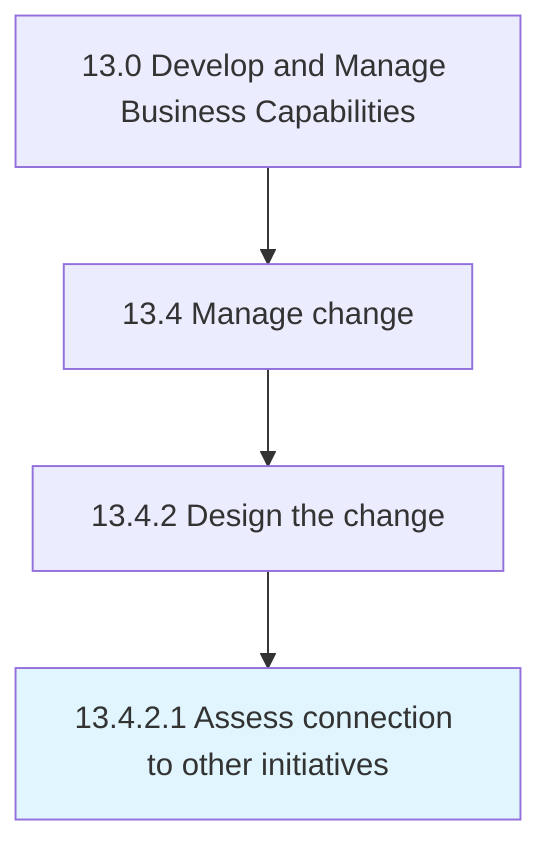

# Assess connection to other initiatives

> Correlating the change initiative with the other initiatives.

## Overview

Activity 13.4.2.1 is an activity within the Develop and Manage Business Capabilities framework. 

Correlating the change initiative with the other initiatives. Create an alignment between the goals and objectives of the change process and that of the other initiatives.

## Process Hierarchy



## Key Statistics

| Metric | Value |
|--------|-------|
| APQC Code | 11152 |
| Hierarchy ID | 13.4.2.1 |
| Level | Activity |
| Parent | [13.4.2](../) |
| Sub-Processes | 0 |


## GraphDL Semantic Structure

```
assess.Connection.to.OtherInitiatives
```

| Component | Value | Description |
|-----------|-------|-------------|
| Verb | `assess` | Primary action |
| Object | `connection` | Direct object |
| Preposition | `to` | Relationship |
| PrepObject | `other initiatives` | Indirect object |


## Related Concepts

- Connection
- OtherInitiatives


---

*Source: APQC PCF 11152 (13.4.2.1) - APQC*
