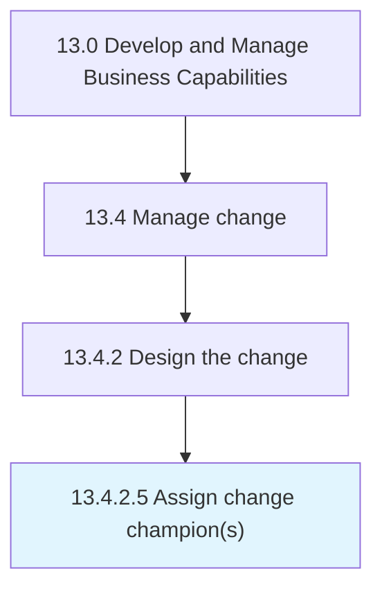

# Assign change champion(s)

> Utilizing champions that have been trained to carry out needed changes.

## Overview

Activity 13.4.2.5 is an activity within the Develop and Manage Business Capabilities framework. 

Utilizing champions that have been trained to carry out needed changes. Engage champions to communicate roles and responsibilities for the change.

## Process Hierarchy



## Key Statistics

| Metric | Value |
|--------|-------|
| APQC Code | 20145 |
| Hierarchy ID | 13.4.2.5 |
| Level | Activity |
| Parent | [13.4.2](../) |
| Sub-Processes | 0 |


## GraphDL Semantic Structure

```
assign.ChangeChampions
```

| Component | Value | Description |
|-----------|-------|-------------|
| Verb | `assign` | Primary action |
| Object | `change champion(s)` | Direct object |


## Related Concepts

- [ChangeChampion(S](/concepts/ChangeChampion(S)


---

*Source: APQC PCF 20145 (13.4.2.5) - APQC*
