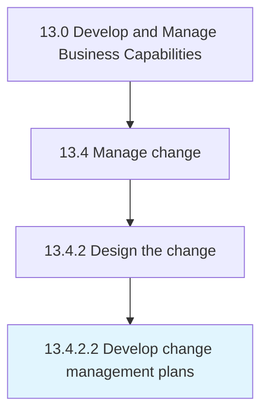

# Develop change management plans

> Creating a detailed structure summary for the purposes of managing the change.

## Overview

Activity 13.4.2.2 is an activity within the Develop and Manage Business Capabilities framework. 

Creating a detailed structure summary for the purposes of managing the change. Demonstrate the reasons for the change. Define the type and scope of change. Form a change management team. Create a communication plan.

## Process Hierarchy



## Key Statistics

| Metric | Value |
|--------|-------|
| APQC Code | 11153 |
| Hierarchy ID | 13.4.2.2 |
| Level | Activity |
| Parent | [13.4.2](../) |
| Sub-Processes | 0 |


## GraphDL Semantic Structure

```
develop.ChangeManagementPlans
```

| Component | Value | Description |
|-----------|-------|-------------|
| Verb | `develop` | Primary action |
| Object | `change management plans` | Direct object |


## Related Concepts

- [ChangeManagementPlans](/concepts/ChangeManagementPlans)


---

*Source: APQC PCF 11153 (13.4.2.2) - APQC*
