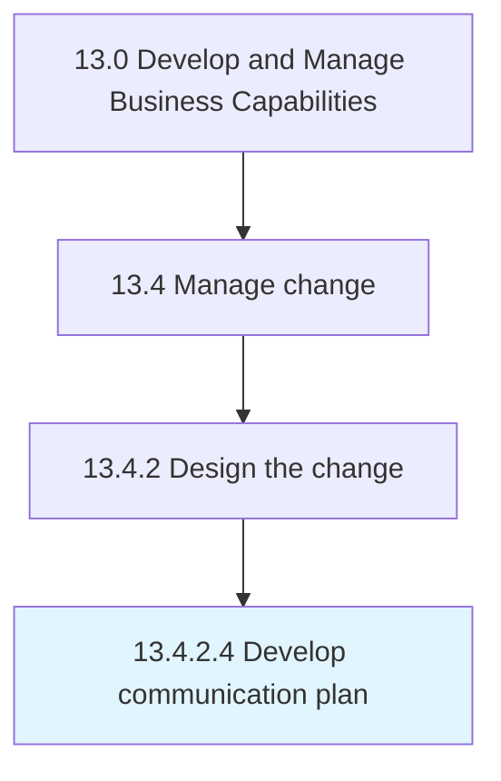

# Develop communication plan

> Developing a plan for imparting or exchanging information relevant the to change.

## Overview

Activity 13.4.2.4 is an activity within the Develop and Manage Business Capabilities framework. 

Developing a plan for imparting or exchanging information relevant the to change. Define goals, objectives, and audience. Gather tools for all communications.

## Process Hierarchy



## Key Statistics

| Metric | Value |
|--------|-------|
| APQC Code | 11155 |
| Hierarchy ID | 13.4.2.4 |
| Level | Activity |
| Parent | [13.4.2](../) |
| Sub-Processes | 0 |


## GraphDL Semantic Structure

```
develop.CommunicationPlan
```

| Component | Value | Description |
|-----------|-------|-------------|
| Verb | `develop` | Primary action |
| Object | `communication plan` | Direct object |


## Related Concepts

- [CommunicationPlan](/concepts/CommunicationPlan)


---

*Source: APQC PCF 11155 (13.4.2.4) - APQC*
