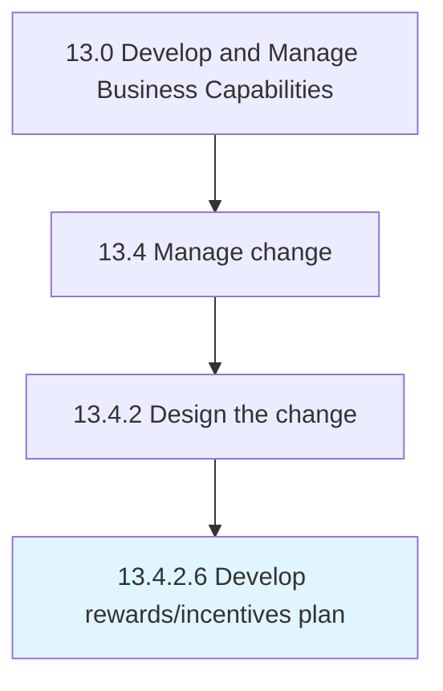

# Develop rewards/incentives plan

> Creating and designing the plan for rewarding the employees exhibiting the desired behavior.

## Overview

Activity 13.4.2.6 is an activity within the Develop and Manage Business Capabilities framework. 

Creating and designing the plan for rewarding the employees exhibiting the desired behavior. Specify rewards in recognition of service, effort, or achievement regarding the change, including bonuses, compensation, stock options, profit sharing, vacations, and flexible time.

## Process Hierarchy



## Key Statistics

| Metric | Value |
|--------|-------|
| APQC Code | 11156 |
| Hierarchy ID | 13.4.2.6 |
| Level | Activity |
| Parent | [13.4.2](../) |
| Sub-Processes | 0 |


## GraphDL Semantic Structure

```
develop.RewardsincentivesPlan
```

| Component | Value | Description |
|-----------|-------|-------------|
| Verb | `develop` | Primary action |
| Object | `rewards/incentives plan` | Direct object |


## Related Concepts

- [RewardsPlan](/concepts/RewardsPlan)
- [IncentivesPlan](/concepts/IncentivesPlan)


---

*Source: APQC PCF 11156 (13.4.2.6) - APQC*
