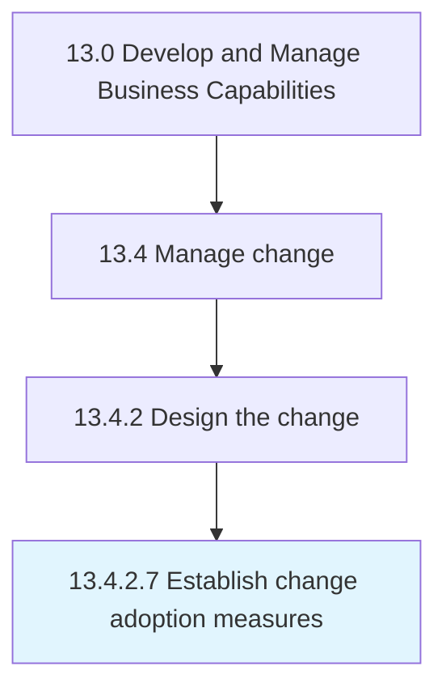

# Establish change adoption measures

> Establishing a system or standard of measurement for measuring the adoption of the change.

## Overview

Activity 13.4.2.7 is an activity within the Develop and Manage Business Capabilities framework. 

Establishing a system or standard of measurement for measuring the adoption of the change. Consider activities such as the number of people who have adopted the change, how quickly have they adopted, number of unique adopters, and adopters by teams/divisions.

## Process Hierarchy



## Key Statistics

| Metric | Value |
|--------|-------|
| APQC Code | 11157 |
| Hierarchy ID | 13.4.2.7 |
| Level | Activity |
| Parent | [13.4.2](../) |
| Sub-Processes | 0 |


## GraphDL Semantic Structure

```
establish.ChangeAdoptionMeasures
```

| Component | Value | Description |
|-----------|-------|-------------|
| Verb | `establish` | Primary action |
| Object | `change adoption measures` | Direct object |


## Related Concepts

- ChangeAdoptionMeasures


---

*Source: APQC PCF 11157 (13.4.2.7) - APQC*
