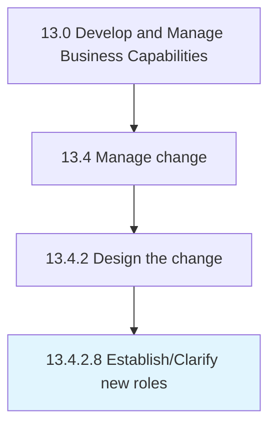

# Establish/Clarify new roles

> Establishing and explaining the new roles to employees.

## Overview

Activity 13.4.2.8 is an activity within the Develop and Manage Business Capabilities framework. 

Establishing and explaining the new roles to employees. Assign roles and responsibilities to resources.

## Process Hierarchy



## Key Statistics

| Metric | Value |
|--------|-------|
| APQC Code | 11158 |
| Hierarchy ID | 13.4.2.8 |
| Level | Activity |
| Parent | [13.4.2](../) |
| Sub-Processes | 0 |


## GraphDL Semantic Structure

```
establish/clarify.NewRoles
```

| Component | Value | Description |
|-----------|-------|-------------|
| Verb | `establish/clarify` | Primary action |
| Object | `new roles` | Direct object |


## Related Concepts

- NewRoles
- NewRoles


---

*Source: APQC PCF 11158 (13.4.2.8) - APQC*
