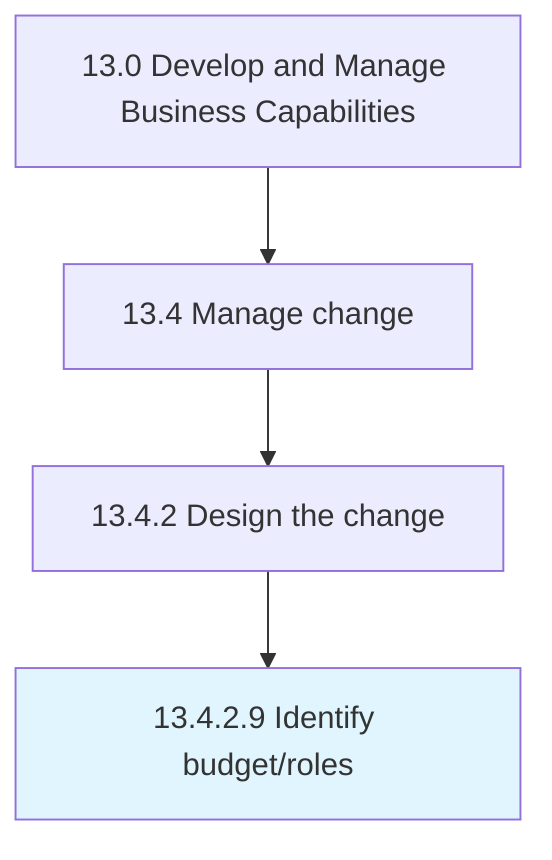

# Identify budget/roles

> Creating a plan of financial outlay for the newly defined roles.

## Overview

Activity 13.4.2.9 is an activity within the Develop and Manage Business Capabilities framework. 

Creating a plan of financial outlay for the newly defined roles. Determine the amount of capital the organization is willing to invest in effectuating these new roles, how would the roles be financed, and what would comprise the ROI from these flows. Coordinate personnel responsible for change management and the finance division.

## Process Hierarchy



## Key Statistics

| Metric | Value |
|--------|-------|
| APQC Code | 11159 |
| Hierarchy ID | 13.4.2.9 |
| Level | Activity |
| Parent | [13.4.2](../) |
| Sub-Processes | 0 |


## GraphDL Semantic Structure

```
identify.Budgetroles
```

| Component | Value | Description |
|-----------|-------|-------------|
| Verb | `identify` | Primary action |
| Object | `budget/roles` | Direct object |


## Related Concepts

- [Budget](/concepts/Budget)
- [Roles](/concepts/Roles)


---

*Source: APQC PCF 11159 (13.4.2.9) - APQC*
