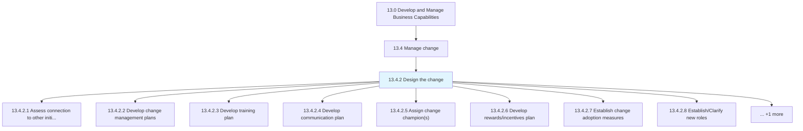
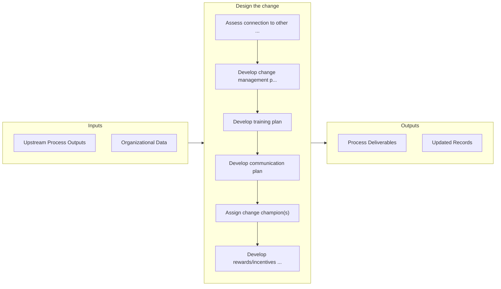

# Design the change

> Developing plans for change management, training, communication, and rewards/incentives.

## Overview

Process 13.4.2 is a core process that defines the specific procedures for design the change. 

Developing plans for change management, training, communication, and rewards/incentives. Establish metrics for measuring the change adoption. Clarify new roles for employees. Identify budgets.

## Process Hierarchy



## Key Statistics

| Metric | Value |
|--------|-------|
| APQC Code | 11135 |
| Hierarchy ID | 13.4.2 |
| Level | Process |
| Parent | [13.4](../) |
| Sub-Processes | 9 |


## GraphDL Semantic Structure

```
design.TheChange
```

| Component | Value | Description |
|-----------|-------|-------------|
| Verb | `design` | Primary action |
| Object | `the change` | Direct object |


## Process Flow



## Sub-Processes

| Process | Hierarchy ID | Description |
|---------|-------------|-------------|
| [Assess connection to other initiatives](./AssessConnectionToOtherInitiatives) | 13.4.2.1 | Correlating the change initiative with the other initiatives |
| [Develop change management plans](./DevelopChangeManagementPlans) | 13.4.2.2 | Creating a detailed structure summary for the purposes of managing the change |
| [Develop training plan](./DevelopTrainingPlan) | 13.4.2.3 | Creating a detailed summary of all the actions relevant to teaching a person a particular skill or t |
| [Develop communication plan](./DevelopCommunicationPlan) | 13.4.2.4 | Developing a plan for imparting or exchanging information relevant the to change |
| [Assign change champion(s)](./AssignChangeChampions) | 13.4.2.5 | Utilizing champions that have been trained to carry out needed changes |
| [Develop rewards/incentives plan](./DevelopRewardsincentivesPlan) | 13.4.2.6 | Creating and designing the plan for rewarding the employees exhibiting the desired behavior |
| [Establish change adoption measures](./EstablishChangeAdoptionMeasures) | 13.4.2.7 | Establishing a system or standard of measurement for measuring the adoption of the change |
| [Establish/Clarify new roles](./EstablishClarifyNewRoles) | 13.4.2.8 | Establishing and explaining the new roles to employees |
| [Identify budget/roles](./IdentifyBudgetroles) | 13.4.2.9 | Creating a plan of financial outlay for the newly defined roles |


## Related Concepts

- [Change](/concepts/Change)


---

*Source: APQC PCF 11135 (13.4.2) - APQC*
