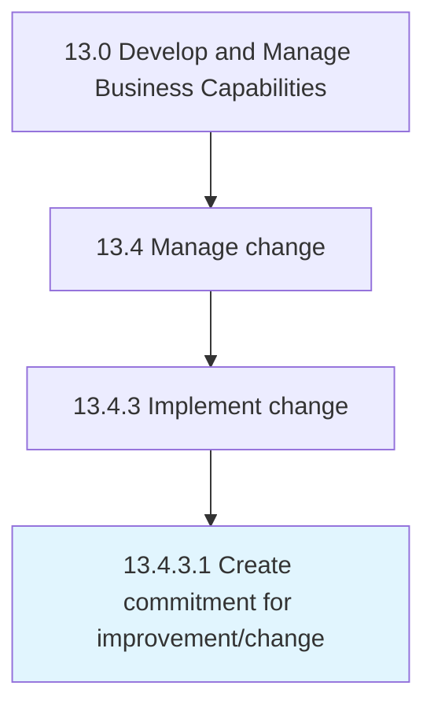

# Create commitment for improvement/change

> Kindling an organization wide commitment for effectuating the change.

## Overview

Activity 13.4.3.1 is an activity within the Develop and Manage Business Capabilities framework. 

Kindling an organization wide commitment for effectuating the change. Effectively communicate the advantages of the desired change. Personalize the pitch for change.

## Process Hierarchy



## Key Statistics

| Metric | Value |
|--------|-------|
| APQC Code | 11160 |
| Hierarchy ID | 13.4.3.1 |
| Level | Activity |
| Parent | [13.4.3](../) |
| Sub-Processes | 0 |


## GraphDL Semantic Structure

```
create.Commitment.for.Improvementchange
```

| Component | Value | Description |
|-----------|-------|-------------|
| Verb | `create` | Primary action |
| Object | `commitment` | Direct object |
| Preposition | `for` | Relationship |
| PrepObject | `improvement/change` | Indirect object |


## Related Concepts

- Commitment
- Improvement
- Commitment
- Change


---

*Source: APQC PCF 11160 (13.4.3.1) - APQC*
