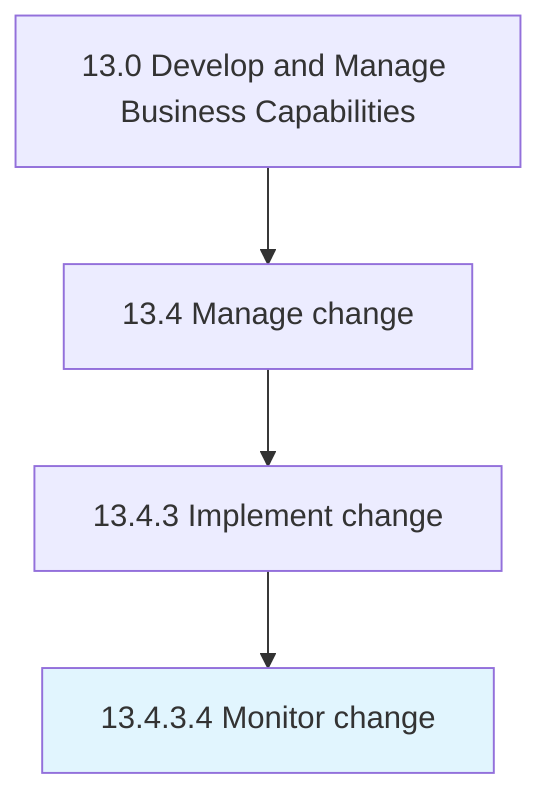

# Monitor change

> Monitoring activities in the change process in order to assess the performance of individual agents and the process as a whole.

## Overview

Activity 13.4.3.4 is an activity within the Develop and Manage Business Capabilities framework. 

Monitoring activities in the change process in order to assess the performance of individual agents and the process as a whole. Oversee the implementation of activities needed for effectuating the change. Track the pace, impact, enthusiasm, reaction, and feedback over the change process.

## Process Hierarchy



## Key Statistics

| Metric | Value |
|--------|-------|
| APQC Code | 11163 |
| Hierarchy ID | 13.4.3.4 |
| Level | Activity |
| Parent | [13.4.3](../) |
| Sub-Processes | 0 |


## GraphDL Semantic Structure

```
monitor.Change
```

| Component | Value | Description |
|-----------|-------|-------------|
| Verb | `monitor` | Primary action |
| Object | `change` | Direct object |


## Related Concepts

- [Change](/concepts/Change)


---

*Source: APQC PCF 11163 (13.4.3.4) - APQC*
