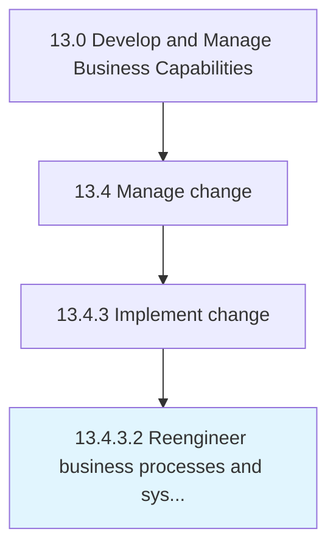

# Reengineer business processes and systems

> Restructuring, redesigning, repurposing, and/or retrofitting existing business processes, activities, and frameworks in order to effectuate the desired change.

## Overview

Activity 13.4.3.2 is an activity within the Develop and Manage Business Capabilities framework. 

Restructuring, redesigning, repurposing, and/or retrofitting existing business processes, activities, and frameworks in order to effectuate the desired change. Review pertinent processes from the ground up by starting with the desired result. (Build on Select a process improvement methodology [11138] to create business processes that perfectly fit with the road map for change.)

## Process Hierarchy



## Key Statistics

| Metric | Value |
|--------|-------|
| APQC Code | 11161 |
| Hierarchy ID | 13.4.3.2 |
| Level | Activity |
| Parent | [13.4.3](../) |
| Sub-Processes | 0 |


## GraphDL Semantic Structure

```
reengineer.BusinessProcessesAndSystems
```

| Component | Value | Description |
|-----------|-------|-------------|
| Verb | `reengineer` | Primary action |
| Object | `business processes and systems` | Direct object |


## Related Concepts

- BusinessProcesses
- Systems


---

*Source: APQC PCF 11161 (13.4.3.2) - APQC*
