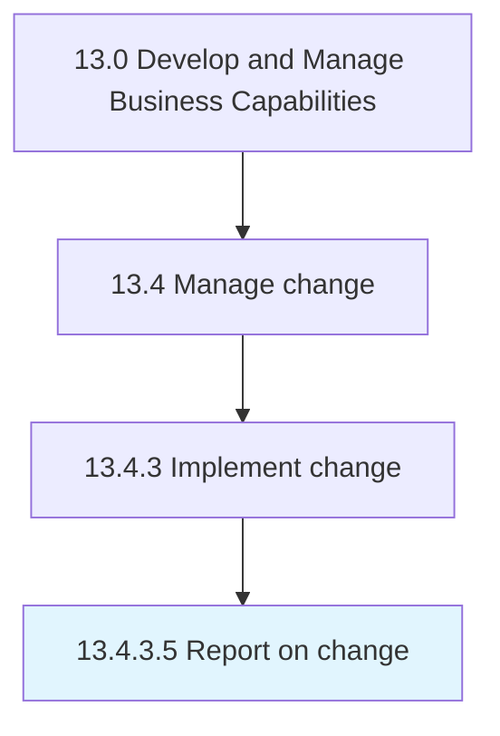

# Report on change

> Reporting on the outcome of the change.

## Overview

Activity 13.4.3.5 is an activity within the Develop and Manage Business Capabilities framework. 

Reporting on the outcome of the change. Document changes and the impact those changes had on critical assets. Share findings with those within the target audience: those impacted by the change, change champions, stakeholders, etc.

## Process Hierarchy



## Key Statistics

| Metric | Value |
|--------|-------|
| APQC Code | 20146 |
| Hierarchy ID | 13.4.3.5 |
| Level | Activity |
| Parent | [13.4.3](../) |
| Sub-Processes | 0 |


## GraphDL Semantic Structure

```
report.OnChange
```

| Component | Value | Description |
|-----------|-------|-------------|
| Verb | `report` | Primary action |
| Object | `on change` | Direct object |


## Related Concepts

- [Change](/concepts/Change)


---

*Source: APQC PCF 20146 (13.4.3.5) - APQC*
