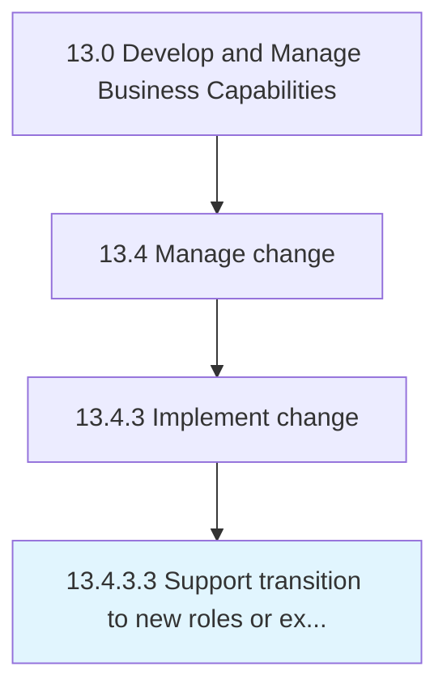

# Support transition to new roles or exit strategies for incumbents

> Supporting the transition of personnel to new roles and the dismissal of any existing employees, necessitated for the desired change.

## Overview

Activity 13.4.3.3 is an activity within the Develop and Manage Business Capabilities framework. 

Supporting the transition of personnel to new roles and the dismissal of any existing employees, necessitated for the desired change. Create an on-boarding process for seamlessly transitioning personnel to new roles. Offer orientation and training. Address any concerns. Create a structured procedure for the discharge of incumbents from their positions.

## Process Hierarchy



## Key Statistics

| Metric | Value |
|--------|-------|
| APQC Code | 11162 |
| Hierarchy ID | 13.4.3.3 |
| Level | Activity |
| Parent | [13.4.3](../) |
| Sub-Processes | 0 |


## GraphDL Semantic Structure

```
support.Transition.to.NewRolesOrExitStrategiesForIncumbents
```

| Component | Value | Description |
|-----------|-------|-------------|
| Verb | `support` | Primary action |
| Object | `transition` | Direct object |
| Preposition | `to` | Relationship |
| PrepObject | `new roles or exit strategies for incumbents` | Indirect object |


## Related Concepts

- Transition
- NewRoles
- Transition
- ExitStrategiesForIncumbents


---

*Source: APQC PCF 11162 (13.4.3.3) - APQC*
