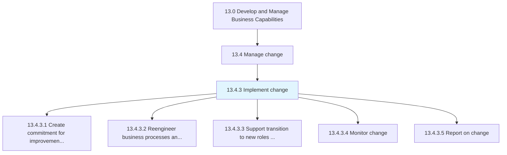
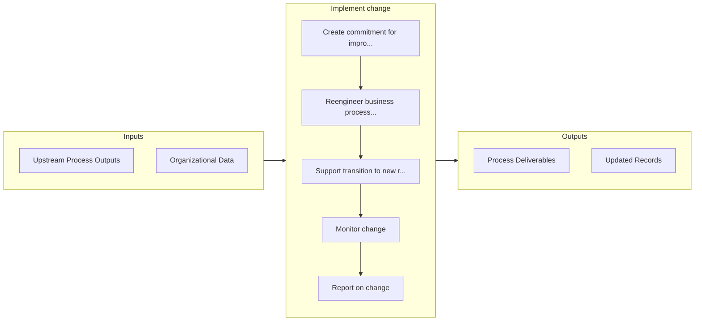

# Implement change

> Effectuating the change within the desired impact areas of the organization.

## Overview

Process 13.4.3 is a core process that defines the specific procedures for implement change. 

Effectuating the change within the desired impact areas of the organization. Ensure adequate commitment from all corners of the organization for the desired change. Create support structures. Refashion all processes deemed necessary. Observe the progress.

## Process Hierarchy



## Key Statistics

| Metric | Value |
|--------|-------|
| APQC Code | 11136 |
| Hierarchy ID | 13.4.3 |
| Level | Process |
| Parent | [13.4](../) |
| Sub-Processes | 5 |


## GraphDL Semantic Structure

```graphdl
implement.Change
```

| Component | Value | Description |
|-----------|-------|-------------|
| Verb | `implement` | Primary action |
| Object | `change` | Direct object |


## Process Flow



## Sub-Processes

| Process | Hierarchy ID | Description |
|---------|-------------|-------------|
| [Create commitment for improvement/change](./CreateCommitmentForImprovementchange) | 13.4.3.1 | Kindling an organization wide commitment for effectuating the change |
| [Reengineer business processes and systems](./ReengineerBusinessProcessesAndSystems) | 13.4.3.2 | Restructuring, redesigning, repurposing, and/or retrofitting existing business processes, activities |
| [Support transition to new roles or exit strategies for incumbents](./SupportTransitionToNewRolesOrExitStrategiesForIncumbents) | 13.4.3.3 | Supporting the transition of personnel to new roles and the dismissal of any existing employees, nec |
| [Monitor change](./MonitorChange) | 13.4.3.4 | Monitoring activities in the change process in order to assess the performance of individual agents  |
| [Report on change](./ReportOnChange) | 13.4.3.5 | Reporting on the outcome of the change |


## Related Concepts

- Change


---

*Source: APQC PCF 11136 (13.4.3) - APQC*
