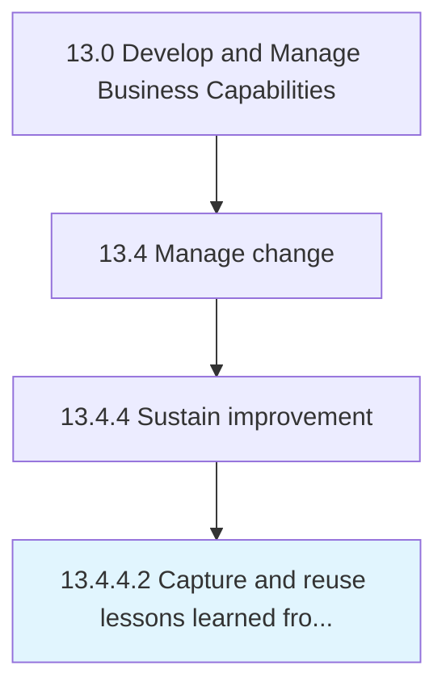

# Capture and reuse lessons learned from change process

> Documenting and standardizing insights gleaned and the knowledge acquired from studying the change process already implemented.

## Overview

Activity 13.4.4.2 is an activity within the Develop and Manage Business Capabilities framework. 

Documenting and standardizing insights gleaned and the knowledge acquired from studying the change process already implemented. Create case studies/best practices guides from the process of implementing change. Include experienced personnel.

## Process Hierarchy



## Key Statistics

| Metric | Value |
|--------|-------|
| APQC Code | 11165 |
| Hierarchy ID | 13.4.4.2 |
| Level | Activity |
| Parent | [13.4.4](../) |
| Sub-Processes | 0 |


## GraphDL Semantic Structure

```
capture.AndReuseLessonsLearned.from.ChangeProcess
```

| Component | Value | Description |
|-----------|-------|-------------|
| Verb | `capture` | Primary action |
| Object | `and reuse lessons learned` | Direct object |
| Preposition | `from` | Relationship |
| PrepObject | `change process` | Indirect object |


## Related Concepts

- [ReuseLessonsLearned](/concepts/ReuseLessonsLearned)
- [ChangeProcess](/concepts/ChangeProcess)


---

*Source: APQC PCF 11165 (13.4.4.2) - APQC*
