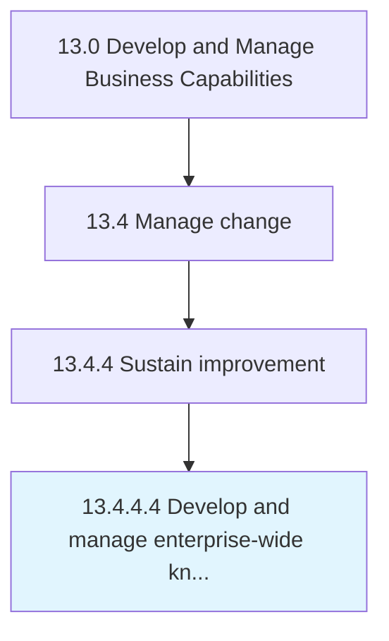

# Develop and manage enterprise-wide knowledge management (KM) capability

> Creating and administering the capability of the organization's knowledge management function.

## Overview

Activity 13.4.4.4 is an activity within the Develop and Manage Business Capabilities framework. 

Creating and administering the capability of the organization's knowledge management function. Develop a strategy for knowledge management. Assess capabilities of the knowledge management function.

## Process Hierarchy



## Key Statistics

| Metric | Value |
|--------|-------|
| APQC Code | 11073 |
| Hierarchy ID | 13.4.4.4 |
| Level | Activity |
| Parent | [13.4.4](../) |
| Sub-Processes | 0 |


## GraphDL Semantic Structure

```
develop.AndManageEnterprisewideKnowledgeManagementKMCapability
```

| Component | Value | Description |
|-----------|-------|-------------|
| Verb | `develop` | Primary action |
| Object | `and manage enterprise-wide knowledge management (KM) capability` | Direct object |


---

*Source: APQC PCF 11073 (13.4.4.4) - APQC*
