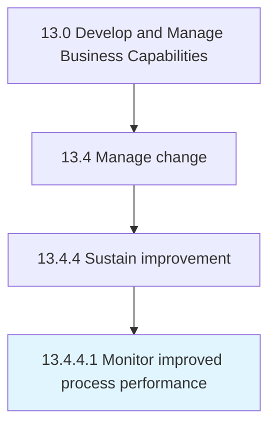

# Monitor improved process performance

> Monitoring the performance of improved business processes.

## Overview

Activity 13.4.4.1 is an activity within the Develop and Manage Business Capabilities framework. 

Monitoring the performance of improved business processes. Track the key performance indicators of the upgraded processes in order to gauge its contribution to the desired change. Expedite through the use of business process management software.

## Process Hierarchy



## Key Statistics

| Metric | Value |
|--------|-------|
| APQC Code | 11164 |
| Hierarchy ID | 13.4.4.1 |
| Level | Activity |
| Parent | [13.4.4](../) |
| Sub-Processes | 0 |


## GraphDL Semantic Structure

```
monitor.ImprovedProcessPerformance
```

| Component | Value | Description |
|-----------|-------|-------------|
| Verb | `monitor` | Primary action |
| Object | `improved process performance` | Direct object |


## Related Concepts

- [ImprovedProcessPerformance](/concepts/ImprovedProcessPerformance)


---

*Source: APQC PCF 11164 (13.4.4.1) - APQC*
