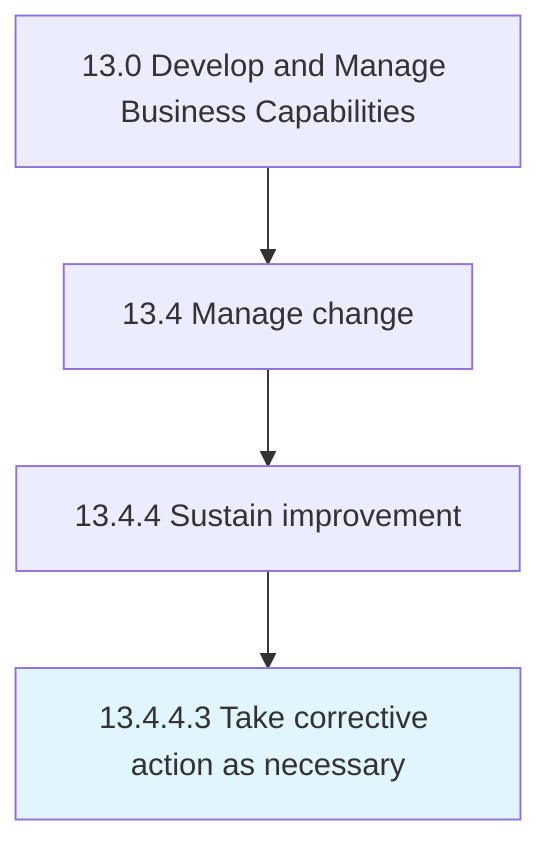

# Take corrective action as necessary

> Implement corrective action to adjust the re-engineered processes for maximizing the desired impact.

## Overview

Activity 13.4.4.3 is an activity within the Develop and Manage Business Capabilities framework. 

Implement corrective action to adjust the re-engineered processes for maximizing the desired impact. Adjust business processes and systems to implement the desired change.

## Process Hierarchy



## Key Statistics

| Metric | Value |
|--------|-------|
| APQC Code | 11166 |
| Hierarchy ID | 13.4.4.3 |
| Level | Activity |
| Parent | [13.4.4](../) |
| Sub-Processes | 0 |


## GraphDL Semantic Structure

```
take.CorrectiveActionAsNecessary
```

| Component | Value | Description |
|-----------|-------|-------------|
| Verb | `take` | Primary action |
| Object | `corrective action as necessary` | Direct object |


## Related Concepts

- [CorrectiveActionAsNecessary](/concepts/CorrectiveActionAsNecessary)


---

*Source: APQC PCF 11166 (13.4.4.3) - APQC*
