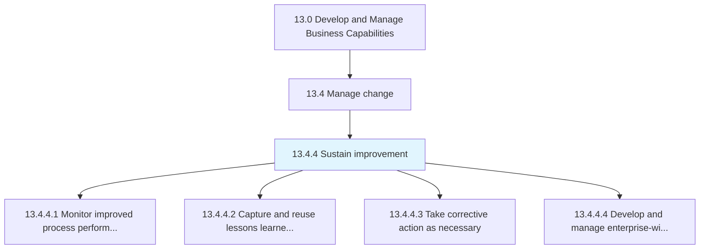
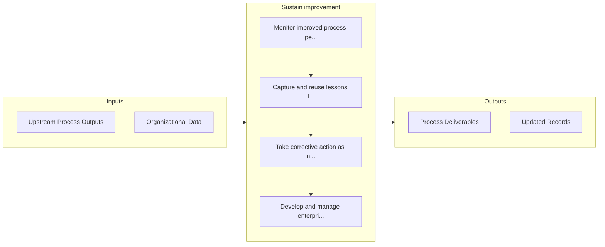

# Sustain improvement

> Sustaining the impact of the change process in order to enact continual process improvement.

## Overview

Process 13.4.4 is a core process that defines the specific procedures for sustain improvement. 

Sustaining the impact of the change process in order to enact continual process improvement. Monitor the performance of re-engineered business processes. Identify best practices and potential issues. Effectuate remedial steps.

## Process Hierarchy



## Key Statistics

| Metric | Value |
|--------|-------|
| APQC Code | 11137 |
| Hierarchy ID | 13.4.4 |
| Level | Process |
| Parent | [13.4](../) |
| Sub-Processes | 4 |


## GraphDL Semantic Structure

```
sustain.Improvement
```

| Component | Value | Description |
|-----------|-------|-------------|
| Verb | `sustain` | Primary action |
| Object | `improvement` | Direct object |


## Process Flow



## Sub-Processes

| Process | Hierarchy ID | Description |
|---------|-------------|-------------|
| [Monitor improved process performance](./MonitorImprovedProcessPerformance) | 13.4.4.1 | Monitoring the performance of improved business processes |
| [Capture and reuse lessons learned from change process](./CaptureAndReuseLessonsLearnedFromChangeProcess) | 13.4.4.2 | Documenting and standardizing insights gleaned and the knowledge acquired from studying the change p |
| [Take corrective action as necessary](./TakeCorrectiveActionAsNecessary) | 13.4.4.3 | Implement corrective action to adjust the re-engineered processes for maximizing the desired impact |
| [Develop and manage enterprise-wide knowledge management (KM) capability](./DevelopAndManageEnterprisewideKnowledgeManagementKMCapability) | 13.4.4.4 | Creating and administering the capability of the organization's knowledge management function |


## Related Concepts

- Improvement


---

*Source: APQC PCF 11137 (13.4.4) - APQC*
