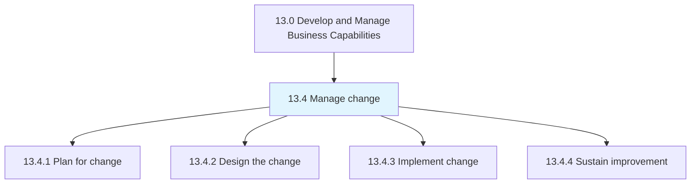
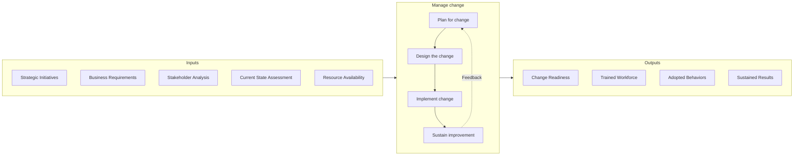
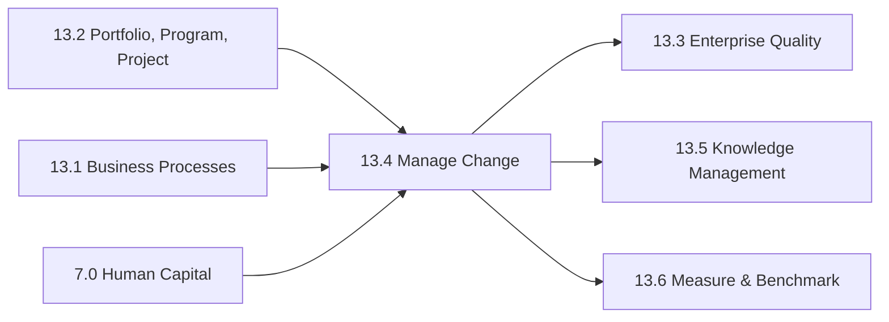

# Manage change

> Planning, designing, and implementing the change.

## Overview

Group 13.4 is a process group within APQC Category 13.0 (Develop and Manage Business Capabilities) that provides the organizational capability to successfully plan, execute, and sustain business changes. Change management is a critical competency that enables organizations to adapt to evolving market conditions, implement new strategies, deploy new technologies, and continuously improve operations.

Effective change management addresses the human, process, and technology dimensions of organizational transformation. It recognizes that successful change requires more than just technical implementation - it demands careful attention to stakeholder engagement, communication, training, and cultural adaptation. Organizations that excel at change management can implement transformations faster, with higher adoption rates and lower resistance.

This process group encompasses the complete change lifecycle: planning for change by understanding current state and defining future state, designing the change approach including training and communication plans, implementing change through structured deployment, and sustaining improvement to ensure lasting results. The iterative nature of change management means that lessons learned feed back into continuous improvement of both the changes themselves and the change management capability.

## Process Hierarchy



## Key Statistics

| Metric | Value |
|--------|-------|
| APQC Code | 11074 |
| Hierarchy ID | 13.4 |
| Level | Group |
| Parent | [13](../) |
| Sub-Processes | 4 |


## GraphDL Semantic Structure

```graphdl
manage.Change
```

| Component | Value | Description |
|-----------|-------|-------------|
| Verb | `manage` | Primary action |
| Object | `change` | Direct object |


## Process Flow



## Child Processes

### 13.4.1 Plan for Change

Evaluating impact and planning change activities spanning the lifecycle of change from initial concept to implementation. This process identifies stakeholders, assesses readiness, defines scope, and establishes accountability for change success.

**Key Activities:**
- Determine stakeholders and assess readiness for change
- Identify change champions and form design team
- Define scope and understand current state
- Define future state and conduct organizational risk analysis
- Identify barriers to change and change enablers
- Develop measures and identify required resources

[View Process Details](./13.4.1-PlanChange/)

### 13.4.2 Design the Change

Developing comprehensive plans for change management including training, communication, and incentive programs. This process creates the detailed approach for how change will be introduced and adopted across the organization.

**Key Activities:**
- Develop change management plan
- Design training and development programs
- Create communication strategy and materials
- Develop rewards and incentive programs
- Plan for knowledge transfer and adoption

[View Process Details](./13.4.2-DesignChange/)

### 13.4.3 Implement Change

Effectuating the change within the desired impact areas of the organization. This process executes the change plan, deploying new processes, systems, or behaviors while managing resistance and tracking adoption.

**Key Activities:**
- Execute change deployment activities
- Deliver training and communication
- Monitor adoption and address resistance
- Manage issues and escalations
- Track progress against change objectives

[View Process Details](./13.4.3-ImplementChange/)

### 13.4.4 Sustain Improvement

Sustaining the impact of the change process to enact continual process improvement. This process ensures that changes become embedded in organizational culture and operations, preventing regression to previous states.

**Key Activities:**
- Monitor and reinforce new behaviors
- Address backsliding and resistance
- Celebrate successes and recognize contributors
- Capture lessons learned
- Integrate changes into standard operations

[View Process Details](./13.4.4-SustainImprovement/)


## RACI Matrix

| Activity | Responsible | Accountable | Consulted | Informed |
|----------|-------------|-------------|-----------|----------|
| Assess change readiness | Change Manager | Change Sponsor | HR, Operations | All stakeholders |
| Identify change champions | Change Manager | Change Sponsor | Department Heads | Teams |
| Design change approach | Change Lead | Change Manager | Subject Matter Experts | Executive team |
| Develop training programs | Training Team | HR Director | Change Manager | Affected employees |
| Create communications | Communications | Change Manager | Marketing | All employees |
| Execute change deployment | Change Lead | Change Manager | Process Owners | Stakeholders |
| Monitor adoption | Change Analyst | Change Manager | Department Heads | Executive team |
| Sustain improvements | Process Owners | Change Sponsor | Change Manager | All employees |


## Metrics and KPIs

| Metric | Description | Target |
|--------|-------------|--------|
| Change Adoption Rate | Percentage of target population using new processes/systems | >90% |
| Change Readiness Score | Assessment of organizational preparedness | >75% |
| Training Completion Rate | Percentage completing required training | 100% |
| Stakeholder Satisfaction | Satisfaction with change process | >4.0/5.0 |
| Time to Adoption | Days from launch to target adoption level | <90 days |
| Resistance Incidents | Number of significant resistance events | Decreasing trend |
| Benefits Realization | Percentage of planned benefits achieved | >85% |
| Change Success Rate | Percentage of changes achieving objectives | >80% |


## Related Departments

- [Executive Office](/departments/Executive) - Change sponsorship and strategic direction
- [Human Resources](/departments/HR) - Training, communication, and organizational development
- [Operations](/departments/Operations) - Process change implementation
- [Information Technology](/departments/IT) - Technology-enabled change
- [Communications](/departments/Communications) - Change communication and messaging
- [Project Management Office](/departments/PMO) - Change initiative coordination


## Related Occupations

- [Training and Development Managers](/occupations/Management/TrainingManagers) - Learning program design
- [Management Analysts](/occupations/Business/ManagementAnalysts) - Change analysis and planning
- [Human Resources Specialists](/occupations/HR/HRSpecialists) - Organizational development
- [General and Operations Managers](/occupations/Management/GeneralManagers) - Change sponsorship
- [Industrial-Organizational Psychologists](/occupations/Social/IOPsychologists) - Behavioral change expertise


## Industry Variations

### Healthcare

Healthcare change management requires careful attention to patient safety implications and clinical workflow impacts. Changes often involve extensive clinical validation, physician engagement, and regulatory compliance considerations. Resistance may be higher due to patient care concerns.

### Financial Services

Financial services change management emphasizes regulatory compliance, risk management, and audit trail requirements. Changes to systems and processes require extensive testing and often phased rollouts. Customer impact and service continuity are critical considerations.

### Technology

Technology organizations often employ agile change management approaches with iterative deployment and continuous feedback. DevOps practices integrate change management into development workflows. Cultural emphasis on innovation may reduce change resistance.

### Manufacturing

Manufacturing change management focuses on production continuity, safety, and quality impacts. Changes often require production line modifications, worker retraining, and supplier coordination. Union considerations may apply in organized environments.


## Change Management Frameworks

Organizations may adopt established methodologies:

- **Prosci ADKAR** - Awareness, Desire, Knowledge, Ability, Reinforcement model
- **Kotter's 8-Step Process** - Creating urgency through anchoring changes
- **Lewin's Change Model** - Unfreeze, Change, Refreeze approach
- **McKinsey 7-S Framework** - Alignment of strategy, structure, systems
- **Bridges Transition Model** - Managing psychological transition


## Related Processes



---

*Source: APQC PCF 11074 (13.4) - APQC*
