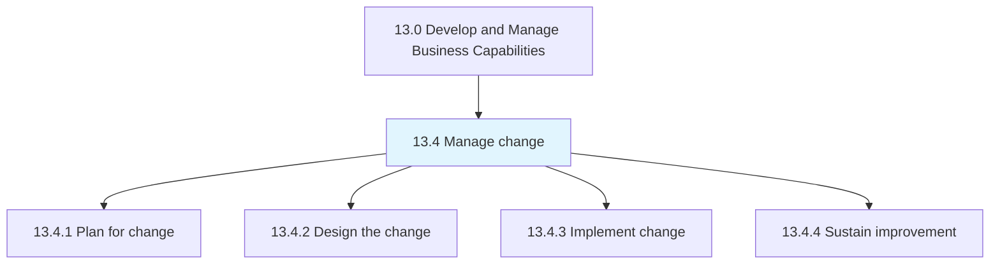
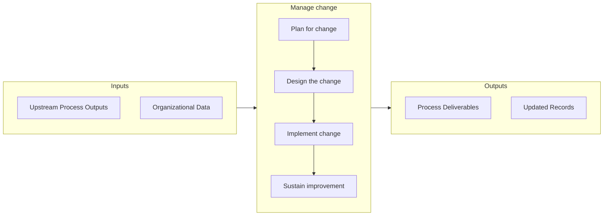

# Manage change

> Planning, designing, and implementing the change.

## Overview

Group 13.4 is a process group within APQC Category 13.0 (Develop and Manage Business Capabilities). 

Planning, designing, and implementing the change. Ensure improvement in the change process.

## Process Hierarchy



## Key Statistics

| Metric | Value |
|--------|-------|
| APQC Code | 11074 |
| Hierarchy ID | 13.4 |
| Level | Group |
| Parent | [13](../) |
| Sub-Processes | 4 |


## GraphDL Semantic Structure

```
manage.Change
```

| Component | Value | Description |
|-----------|-------|-------------|
| Verb | `manage` | Primary action |
| Object | `change` | Direct object |


## Process Flow



## Sub-Processes

| Process | Hierarchy ID | Description |
|---------|-------------|-------------|
| [Plan for change](./13.4.1-PlanChange/) | 13.4.1 | Evaluating impact and planning change activities |
| [Design the change](./13.4.2-DesignChange/) | 13.4.2 | Developing plans for change management, training, communication, and rewards/incentives |
| [Implement change](./13.4.3-ImplementChange/) | 13.4.3 | Effectuating the change within the desired impact areas of the organization |
| [Sustain improvement](./13.4.4-SustainImprovement/) | 13.4.4 | Sustaining the impact of the change process in order to enact continual process improvement |


## Related Concepts

- Change


---

*Source: APQC PCF 11074 (13.4) - APQC*
