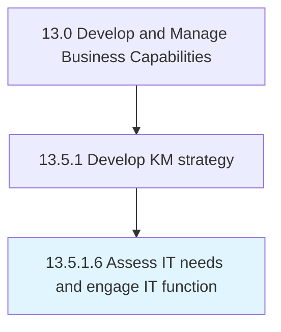

# Assess IT needs and engage IT function

> Determining the IT needs for developing the knowledge management strategy, and collaborating with the IT function to implement the strategy.

## Overview

Activity 13.5.1.6 is an activity within the Develop and Manage Business Capabilities framework. 

Determining the IT needs for developing the knowledge management strategy, and collaborating with the IT function to implement the strategy. Assess requirements for technologies such as computer hardware, software, electronics, semiconductors, internet, and telecommunications equipment in order to effectively build and implement the strategy for knowledge management.

## Process Hierarchy



## Key Statistics

| Metric | Value |
|--------|-------|
| APQC Code | 11106 |
| Hierarchy ID | 13.5.1.6 |
| Level | Activity |
| Parent | [13.5.1](../) |
| Sub-Processes | 0 |


## GraphDL Semantic Structure

```
assess.ITNeedsAndEngageITFunction
```

| Component | Value | Description |
|-----------|-------|-------------|
| Verb | `assess` | Primary action |
| Object | `IT needs and engage IT function` | Direct object |


## Related Concepts

- ITNeeds
- EngageITFunction


---

*Source: APQC PCF 11106 (13.5.1.6) - APQC*
