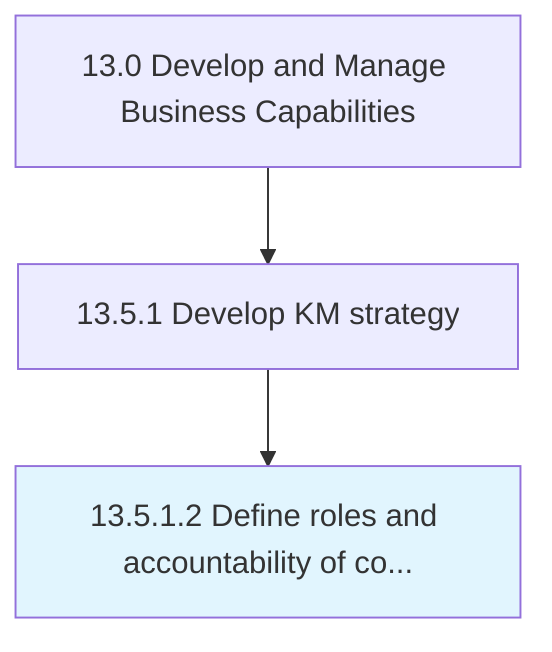

# Define roles and accountability of core group versus operating units

> Clearly determining the roles and responsibilities of all personnel involved in the management of the organization's corpus of knowledge.

## Overview

Activity 13.5.1.2 is an activity within the Develop and Manage Business Capabilities framework. 

Clearly determining the roles and responsibilities of all personnel involved in the management of the organization's corpus of knowledge. Flesh out the roles and responsibilities of the KM core group, as well as the operational staff involved in the upkeep of the knowledge management program.

## Process Hierarchy



## Key Statistics

| Metric | Value |
|--------|-------|
| APQC Code | 11102 |
| Hierarchy ID | 13.5.1.2 |
| Level | Activity |
| Parent | [13.5.1](../) |
| Sub-Processes | 0 |


## GraphDL Semantic Structure

```
define.RolesAndAccountability.of.CoreGroupVersusOperatingUnits
```

| Component | Value | Description |
|-----------|-------|-------------|
| Verb | `define` | Primary action |
| Object | `roles and accountability` | Direct object |
| Preposition | `of` | Relationship |
| PrepObject | `core group versus operating units` | Indirect object |


## Related Concepts

- [Roles](/concepts/Roles)
- [CoreGroupVersusOperatingUnits](/concepts/CoreGroupVersusOperatingUnits)
- [Accountability](/concepts/Accountability)
- [CoreGroupVersusOperatingUnits](/concepts/CoreGroupVersusOperatingUnits)


---

*Source: APQC PCF 11102 (13.5.1.2) - APQC*
