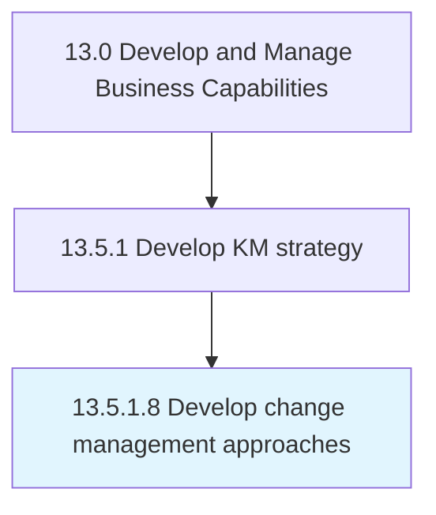

# Develop change management approaches

> Creating approaches for effectively administering the changes in knowledge management.

## Overview

Activity 13.5.1.8 is an activity within the Develop and Manage Business Capabilities framework. 

Creating approaches for effectively administering the changes in knowledge management. Design an approach that transforms individuals, teams, and the organization to a desired future state represented by the change.

## Process Hierarchy



## Key Statistics

| Metric | Value |
|--------|-------|
| APQC Code | 11108 |
| Hierarchy ID | 13.5.1.8 |
| Level | Activity |
| Parent | [13.5.1](../) |
| Sub-Processes | 0 |


## GraphDL Semantic Structure

```
develop.ChangeManagementApproaches
```

| Component | Value | Description |
|-----------|-------|-------------|
| Verb | `develop` | Primary action |
| Object | `change management approaches` | Direct object |


## Related Concepts

- [ChangeManagementApproaches](/concepts/ChangeManagementApproaches)


---

*Source: APQC PCF 11108 (13.5.1.8) - APQC*
