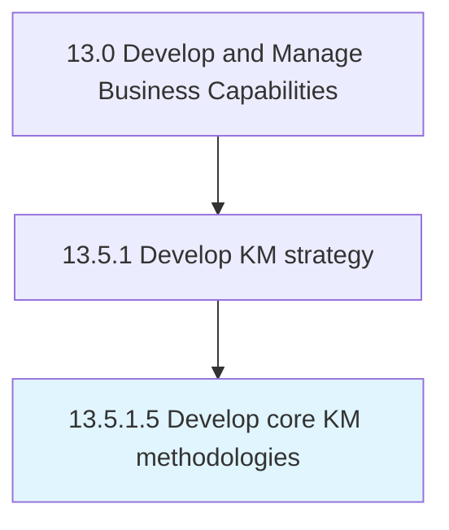

# Develop core KM methodologies

> Creating core knowledge management procedures and methodologies.

## Overview

Activity 13.5.1.5 is an activity within the Develop and Manage Business Capabilities framework. 

Creating core knowledge management procedures and methodologies. Initiate developing a strategy, planning, execution, and improvement.

## Process Hierarchy



## Key Statistics

| Metric | Value |
|--------|-------|
| APQC Code | 11105 |
| Hierarchy ID | 13.5.1.5 |
| Level | Activity |
| Parent | [13.5.1](../) |
| Sub-Processes | 0 |


## GraphDL Semantic Structure

```
develop.CoreKMMethodologies
```

| Component | Value | Description |
|-----------|-------|-------------|
| Verb | `develop` | Primary action |
| Object | `core KM methodologies` | Direct object |


## Related Concepts

- CoreKmMethodologies


---

*Source: APQC PCF 11105 (13.5.1.5) - APQC*
