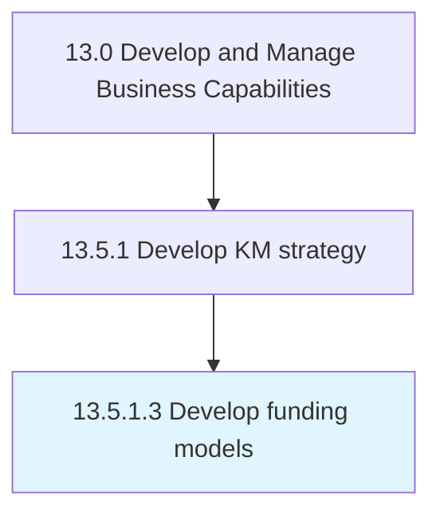

# Develop funding models

> Analyze the organization's current approach to funding.

## Overview

Activity 13.5.1.3 is an activity within the Develop and Manage Business Capabilities framework. 

Analyze the organization's current approach to funding. Learn from the funding approaches of peer organizations. Evaluate the revenue potential and costs of those short-list funding models. Select funding models to implement.

## Process Hierarchy



## Key Statistics

| Metric | Value |
|--------|-------|
| APQC Code | 11103 |
| Hierarchy ID | 13.5.1.3 |
| Level | Activity |
| Parent | [13.5.1](../) |
| Sub-Processes | 0 |


## GraphDL Semantic Structure

```
develop.FundingModels
```

| Component | Value | Description |
|-----------|-------|-------------|
| Verb | `develop` | Primary action |
| Object | `funding models` | Direct object |


## Related Concepts

- [FundingModels](/concepts/FundingModels)


---

*Source: APQC PCF 11103 (13.5.1.3) - APQC*
