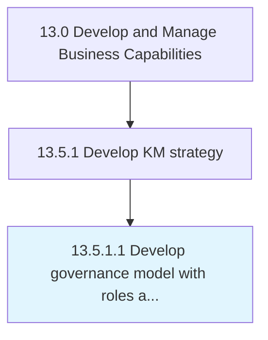

# Develop governance model with roles and accountability

> Developing a structure for the governance of the organization's collective knowledge.

## Overview

Activity 13.5.1.1 is an activity within the Develop and Manage Business Capabilities framework. 

Developing a structure for the governance of the organization's collective knowledge. Gather, maintain, and make accessible the collective knowledge base. Develop a standard procedure for the conservation and perpetuation of the organization's knowledge. Create policies for the usage and maintenance of this knowledge. Establish specialized roles.

## Process Hierarchy



## Key Statistics

| Metric | Value |
|--------|-------|
| APQC Code | 11100 |
| Hierarchy ID | 13.5.1.1 |
| Level | Activity |
| Parent | [13.5.1](../) |
| Sub-Processes | 0 |


## GraphDL Semantic Structure

```
develop.GovernanceModel.with.RolesAndAccountability
```

| Component | Value | Description |
|-----------|-------|-------------|
| Verb | `develop` | Primary action |
| Object | `governance model` | Direct object |
| Preposition | `with` | Relationship |
| PrepObject | `roles and accountability` | Indirect object |


## Related Concepts

- GovernanceModel
- Roles
- GovernanceModel
- Accountability


---

*Source: APQC PCF 11100 (13.5.1.1) - APQC*
