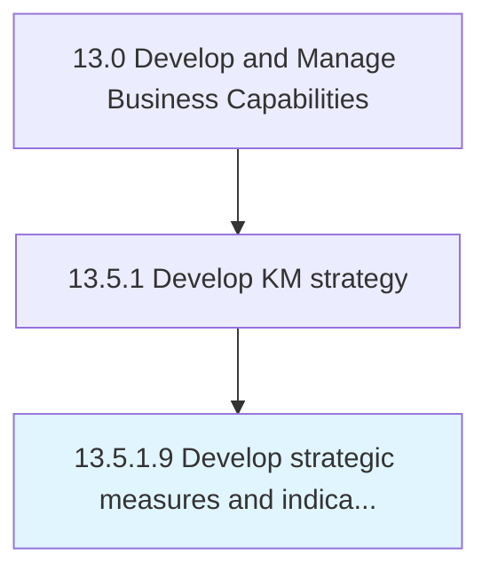

# Develop strategic measures and indicators

> Establishing measures and indicators for evaluating the performance of the knowledge management function.

## Overview

Activity 13.5.1.9 is an activity within the Develop and Manage Business Capabilities framework. 

Establishing measures and indicators for evaluating the performance of the knowledge management function. Define key performance indicators such as the amount of knowledge assets created and number of knowledge projects undertaken.

## Process Hierarchy



## Key Statistics

| Metric | Value |
|--------|-------|
| APQC Code | 11109 |
| Hierarchy ID | 13.5.1.9 |
| Level | Activity |
| Parent | [13.5.1](../) |
| Sub-Processes | 0 |


## GraphDL Semantic Structure

```
develop.StrategicMeasuresAndIndicators
```

| Component | Value | Description |
|-----------|-------|-------------|
| Verb | `develop` | Primary action |
| Object | `strategic measures and indicators` | Direct object |


## Related Concepts

- StrategicMeasures
- Indicators


---

*Source: APQC PCF 11109 (13.5.1.9) - APQC*
