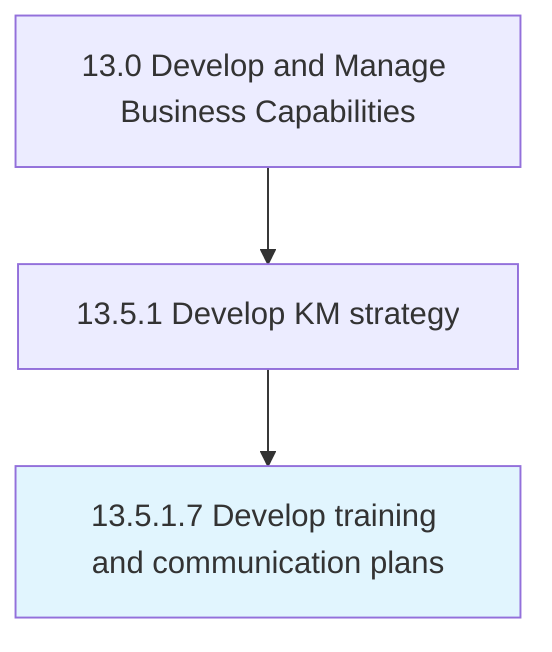

# Develop training and communication plans

> Creating plans for KM training plans and conveying the knowledge management strategy within the organization.

## Overview

Activity 13.5.1.7 is an activity within the Develop and Manage Business Capabilities framework. 

Creating plans for KM training plans and conveying the knowledge management strategy within the organization. Create training programs, sessions, and activities in order to familiarize employees and management with the concept of knowledge management.

## Process Hierarchy



## Key Statistics

| Metric | Value |
|--------|-------|
| APQC Code | 11107 |
| Hierarchy ID | 13.5.1.7 |
| Level | Activity |
| Parent | [13.5.1](../) |
| Sub-Processes | 0 |


## GraphDL Semantic Structure

```
develop.TrainingAndCommunicationPlans
```

| Component | Value | Description |
|-----------|-------|-------------|
| Verb | `develop` | Primary action |
| Object | `training and communication plans` | Direct object |


## Related Concepts

- [TrainingPlans](/concepts/TrainingPlans)
- [CommunicationPlans](/concepts/CommunicationPlans)


---

*Source: APQC PCF 11107 (13.5.1.7) - APQC*
