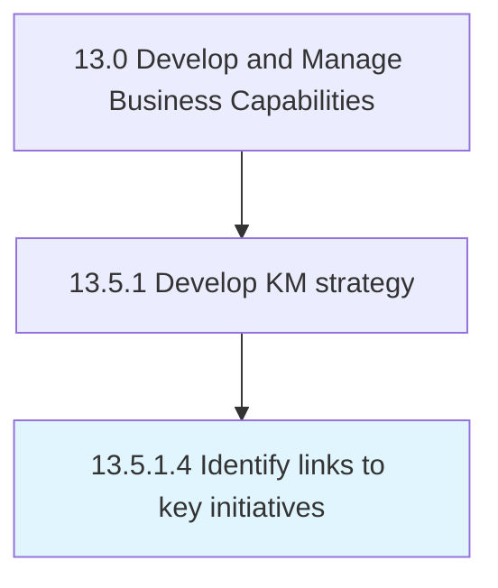

# Identify links to key initiatives

> Identifying any links that exist between the strategy for knowledge management and any other functional areas.

## Overview

Activity 13.5.1.4 is an activity within the Develop and Manage Business Capabilities framework. 

Identifying any links that exist between the strategy for knowledge management and any other functional areas. Determine any correlations that exist between the strategic road map for the knowledge management and any other functional areas. Study each function's/unit's attributes.

## Process Hierarchy



## Key Statistics

| Metric | Value |
|--------|-------|
| APQC Code | 11104 |
| Hierarchy ID | 13.5.1.4 |
| Level | Activity |
| Parent | [13.5.1](../) |
| Sub-Processes | 0 |


## GraphDL Semantic Structure

```
identify.Links.to.KeyInitiatives
```

| Component | Value | Description |
|-----------|-------|-------------|
| Verb | `identify` | Primary action |
| Object | `links` | Direct object |
| Preposition | `to` | Relationship |
| PrepObject | `key initiatives` | Indirect object |


## Related Concepts

- [Links](/concepts/Links)
- [KeyInitiatives](/concepts/KeyInitiatives)


---

*Source: APQC PCF 11104 (13.5.1.4) - APQC*
