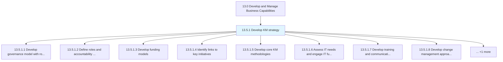
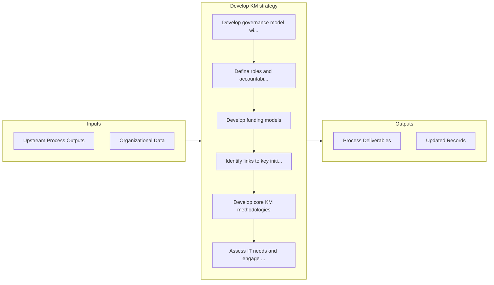

# Develop KM strategy

> Creating a plan for managing the organization's knowledge base.

## Overview

Process 13.5.1 is a core process that defines the specific procedures for develop km strategy. 

Creating a plan for managing the organization's knowledge base. Determine what kind of specialized knowledge the organization possesses, which elements of this collective knowledge can prove beneficial, how to capture and maintain this knowledge, how to grant access to this library of information, and how the organization should proceed.

## Process Hierarchy



## Key Statistics

| Metric | Value |
|--------|-------|
| APQC Code | 11095 |
| Hierarchy ID | 13.5.1 |
| Level | Process |
| Parent | [13.5](../) |
| Sub-Processes | 9 |


## GraphDL Semantic Structure

```
develop.KMStrategy
```

| Component | Value | Description |
|-----------|-------|-------------|
| Verb | `develop` | Primary action |
| Object | `KM strategy` | Direct object |


## Process Flow



## Sub-Processes

| Process | Hierarchy ID | Description |
|---------|-------------|-------------|
| [Develop governance model with roles and accountability](./DevelopGovernanceModelWithRolesAndAccountability) | 13.5.1.1 | Developing a structure for the governance of the organization's collective knowledge |
| [Define roles and accountability of core group versus operating units](./DefineRolesAndAccountabilityOfCoreGroupVersusOperatingUnits) | 13.5.1.2 | Clearly determining the roles and responsibilities of all personnel involved in the management of th |
| [Develop funding models](./DevelopFundingModels) | 13.5.1.3 | Analyze the organization's current approach to funding |
| [Identify links to key initiatives](./IdentifyLinksToKeyInitiatives) | 13.5.1.4 | Identifying any links that exist between the strategy for knowledge management and any other functio |
| [Develop core KM methodologies](./DevelopCoreKMMethodologies) | 13.5.1.5 | Creating core knowledge management procedures and methodologies |
| [Assess IT needs and engage IT function](./AssessITNeedsAndEngageITFunction) | 13.5.1.6 | Determining the IT needs for developing the knowledge management strategy, and collaborating with th |
| [Develop training and communication plans](./DevelopTrainingAndCommunicationPlans) | 13.5.1.7 | Creating plans for KM training plans and conveying the knowledge management strategy within the orga |
| [Develop change management approaches](./DevelopChangeManagementApproaches) | 13.5.1.8 | Creating approaches for effectively administering the changes in knowledge management |
| [Develop strategic measures and indicators](./DevelopStrategicMeasuresAndIndicators) | 13.5.1.9 | Establishing measures and indicators for evaluating the performance of the knowledge management func |


## Related Concepts

- [KmStrategy](/concepts/KmStrategy)


---

*Source: APQC PCF 11095 (13.5.1) - APQC*
